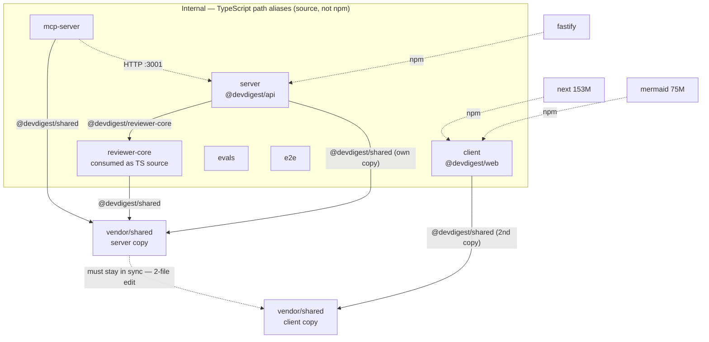

# Report template

Fill this in. The five headings are fixed; everything inside them is yours. Delete a tier heading
only if it has no findings — but never delete a *section*: an empty `## Size Breakdown` that says
"`node_modules` not installed for any package" is a real result, and silence is not.

---

## Scope

Analyzed on `<git sha>` (`<clean|dirty>` tree).

| Package | Package manager | `node_modules` | Analyzed |
|---------|-----------------|----------------|----------|
| `server/` | pnpm | installed | ✅ |
| `client/` | pnpm | installed | ✅ |
| `reviewer-core/` | npm | installed | ✅ |
| `e2e/` | npm | **not installed** | manifest only — no sizes |
| `mcp-server/` | pnpm | installed | ✅ |
| `evals/` | pnpm | installed | ✅ |

Not checked: `<anything you could not reach — a failed advisory feed, an unmeasurable package>`.

## Dependency Graph

Solid arrow = internal source-level link (path alias). Dotted = external npm package or a runtime
(non-source) link. Mark any boundary violation with the `violation` class — that edge is the most
useful thing on the diagram.

## Size Breakdown

| Package | Dependency | Installed size | Note |
|---------|-----------|----------------|------|
| `client` | `next` | 153M | framework, load-bearing |
| `client` | `mermaid` | 75M | on-disk only — ships far less to the browser |
| … | … | … | … |
| **`client`** | **total** | **620M** | |
| **`server`** | **total** | **249M** | |

Repo total: `<N>`G across `<n>` installed packages.

Installed size on disk ≠ bundle size. State which one each figure is.

## Findings & Priorities

### P0 — breaks the build or fails silently at runtime

**[P0-1] `<one-line statement of what is wrong>`**
- Evidence: `<file:line, or the command and its output>`
- Impact: `<what actually breaks, and when>`
- Fix: `<the specific change, with the command to verify it>`

### P1 — real risk, no breakage yet

**[P1-1] …** (same shape)

### P2 — hygiene and weight

**[P2-1] …**

### Info — true, but not actionable by this change

**[INFO-1] `client` reports 11 advisories (1 critical, 2 high) on a clean tree**, all transitive via
`@vitejs/plugin-react > vite`. Pre-existing, not introduced here. Tracked, not blocking.

## Summary

1. `<highest-tier action — what to do, to which package, why it is first>`
2. `<next>`
3. `<next>`

Three to five items, ordered by priority. Each one actionable without scrolling back up.
