# Mermaid Diagram Examples

Ready-to-use templates tailored to the Quick Blog stack (React + Express + MongoDB + JWT).

---

## 1. Flowchart — Blog Post Creation Flow

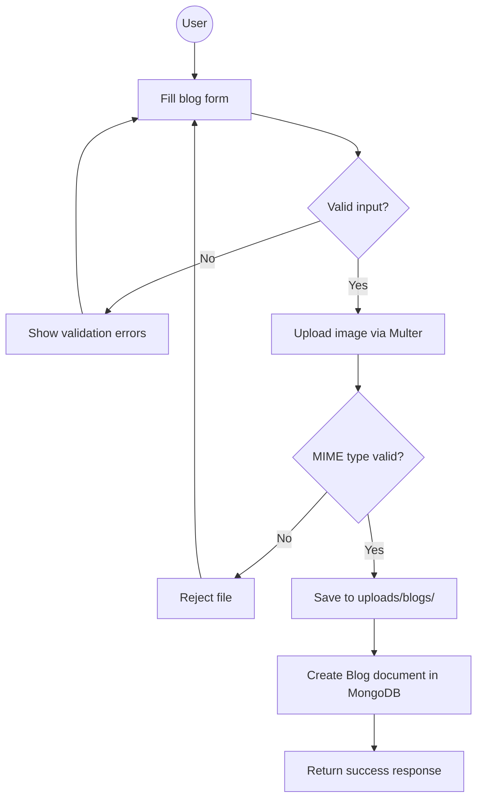

---

## 2. Sequence Diagram — JWT Authentication Flow

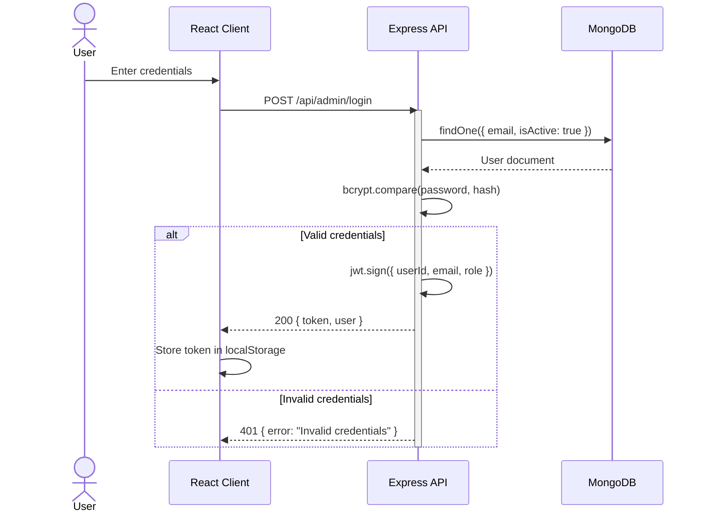

---

## 3. Sequence Diagram — Auth Middleware Chain

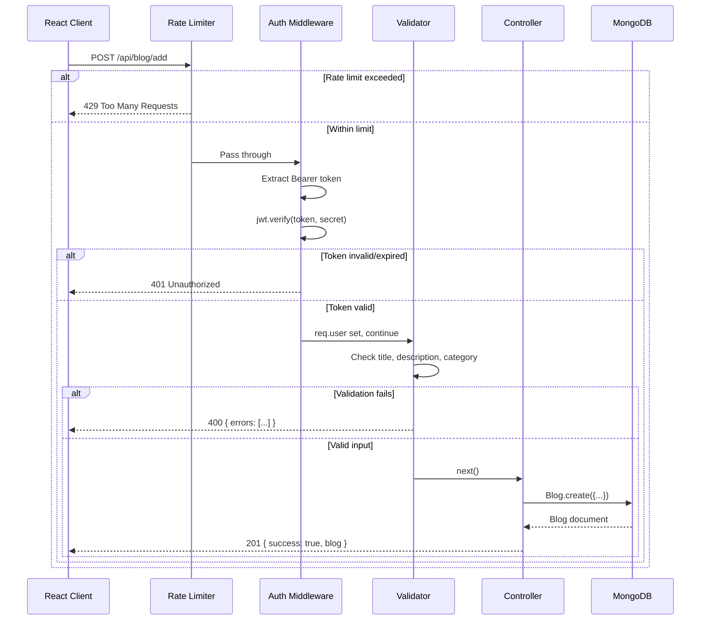

---

## 4. ER Diagram — Blog Database Schema

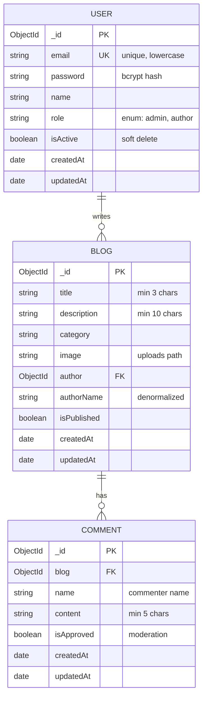

---

## 5. State Diagram — Blog Post Lifecycle

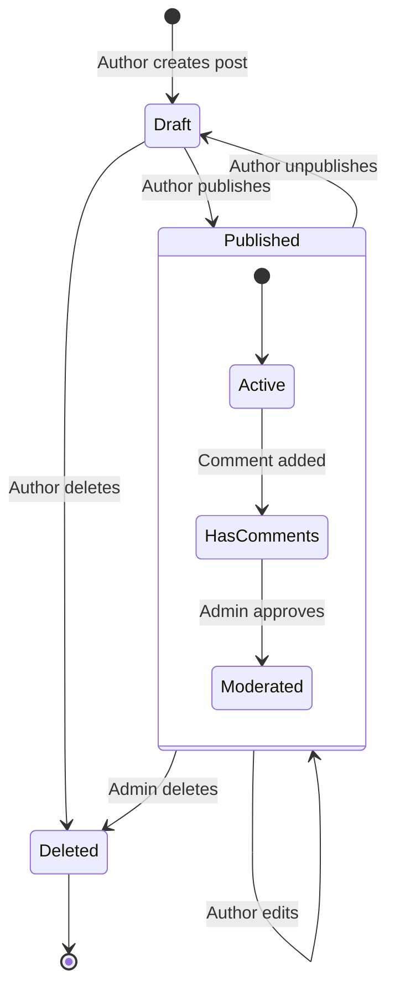

---

## 6. Flowchart — File Upload Security Pipeline

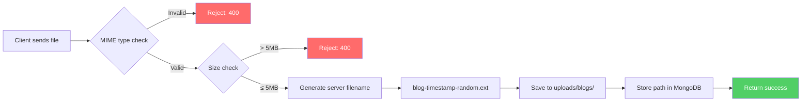

---

## 7. Flowchart — Error Handling Architecture

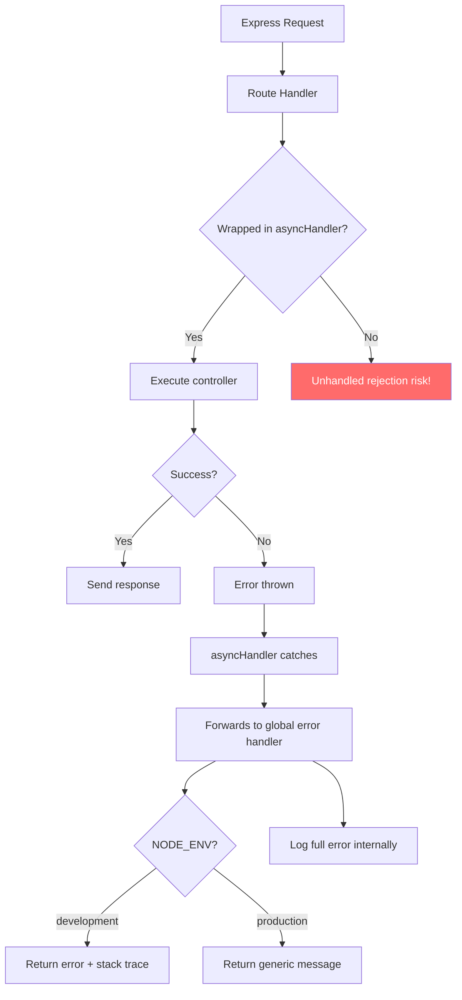

---

## 8. Class Diagram — Mongoose Models

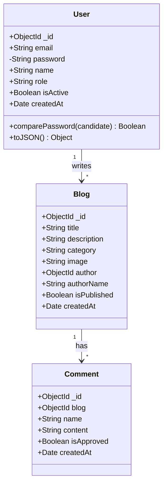

---

## 9. Flowchart — CORS Request Flow

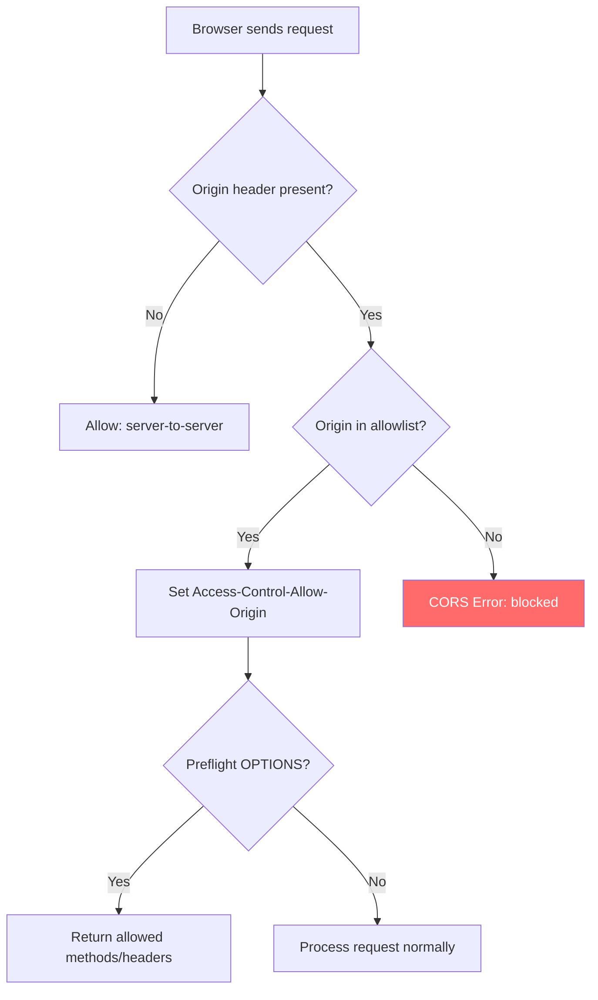

---

## 10. Gantt Chart — Feature Implementation Plan

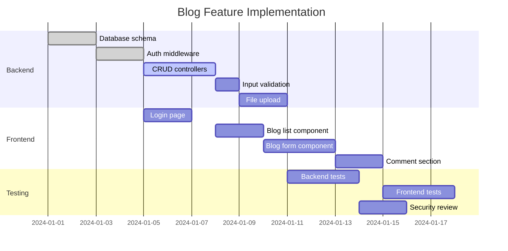

---

## 11. Mindmap — Project Architecture

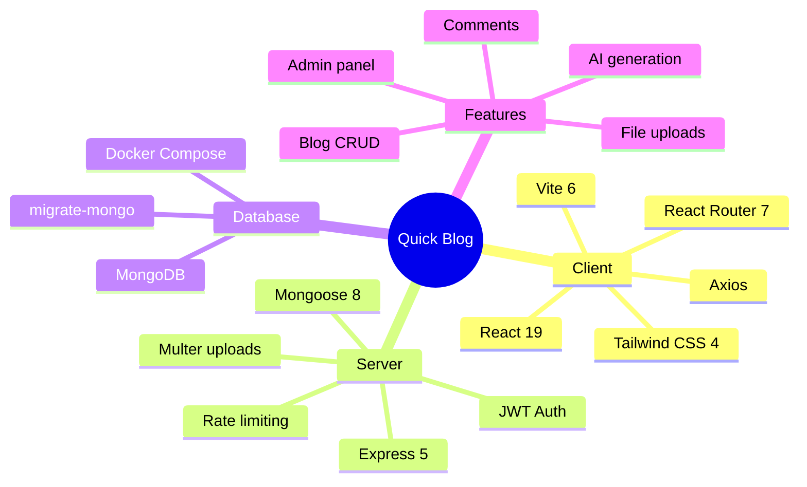

---

## 12. Pie Chart — OWASP Vulnerability Distribution

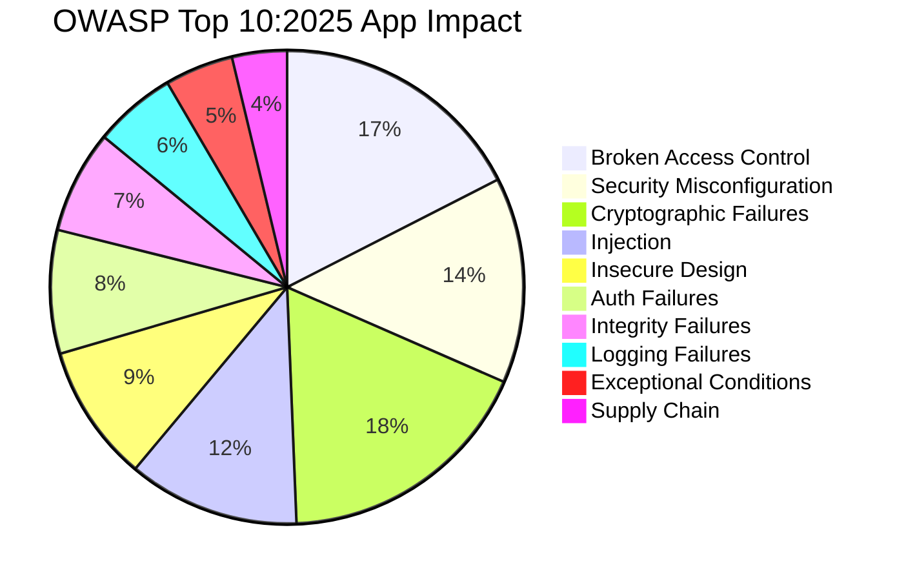
