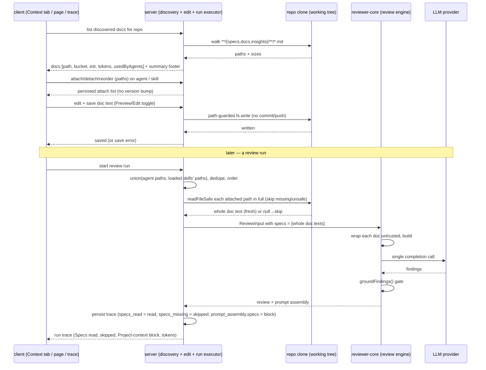

# Spec: Project Context   |   Spec ID: SPEC-2026-07-10-project-context   |   Status: approved
Supersedes: none

## Problem & why

DevDigest review agents today reason only over the diff, the PR body, and a deterministic
repo map. The specs, design docs, and incident write-ups that already live inside a cloned
repository (`specs/`, `docs/`, `insights/`) are invisible to the reviewer — they are
"documents for humans". As a result an agent cannot enforce a rule the team has already
written down (e.g. an architectural invariant, an API contract, a security baseline).

**Project Context** lets a human *manually attach* one or more of those markdown documents
to a review agent and/or a skill. On every review run the attached documents are read fresh
from the clone and injected into the LLM prompt as an **untrusted** `## Project context`
block. The specification stops being passive prose and starts actively driving the review.

This is deliberately the **small** first feature of two: it must demonstrate
specification-in-the-loop with **zero new LLM calls** and **no new selection intelligence**.
Grounding against this tree confirms the injection slot already exists end-to-end but is
never populated:

- `ReviewInput.specs?: string[]` exists (`reviewer-core/src/review/run.ts:44,60`) and
  `reviewPullRequest` passes it straight into `assemblePrompt` (`run.ts:143`), which wraps
  each entry with `wrapUntrusted` and renders it under `## Project context`, then records
  it in `PromptAssembly.specs` (`reviewer-core/src/prompt.ts:69,125-128,148,174`).
- The server run-executor never populates it: `specs` is absent from the `reviewPullRequest`
  input it builds (`server/src/modules/reviews/run-executor.ts:228-250`), and `specs_read`
  is hard-coded `[]` in BOTH the success trace (`run-executor.ts:327`) and the failure trace
  (`run-executor.ts:476`), with `prompt_assembly.specs` hard-coded `null` on the failure
  path (`run-executor.ts:472`).
- The run-trace UI already renders the "Specs read" configuration row and the expandable
  "Project context" prompt-assembly block (with copy + in-block search) — so AC-25 and AC-27
  below are already satisfied on the client and need only server population, not new UI.

This feature fills that gap rather than inventing a parallel mechanism. It reuses the
existing sandboxed clone reader `GitClient.readFileSafe`, whose `safeResolve` already refuses
`..`-traversal and out-of-tree symlinks (`server/src/adapters/git/simple-git.ts:140-168`) —
so the traversal guard the reference spec treats as new already exists for *reads*; the only
new guard this feature must add is on the *edit-write* path (there is no safe write method
on the port today).

## Goals / Non-goals

- Goal: Discover all `.md` files under any folder named `specs`, `docs`, or `insights`
  (at any depth) in a repo's clone, and surface them with a bucket badge and a token estimate.
- Goal: Let a user manually attach/detach and **order** discovered documents on an **agent**
  (new Context tab) and on a **skill** (new Context tab).
- Goal: Store only document **paths** on the agent/skill — never the document text.
- Goal: At review run time, read the union of attached paths (agent + each loaded skill's
  contributed docs) from the clone and inject them into the existing `## Project context`
  prompt slot as an untrusted block, ordered deterministically.
- Goal: Make the injection auditable in the run trace — show the paths read, the paths
  skipped, and the exact injected (untrusted-wrapped) text, with token sizes visible.
- Goal: Demonstrate the end-to-end value with one headline scenario (attach an architectural
  invariant spec → open a PR that violates it → reviewer catches it, citing the spec).
- Goal: Let a user view a discovered document and **edit it in place** via a Preview/Edit
  toggle on the Project Context page, saving the change back to the file in the clone working
  tree. (Feasibility confirmed against this tree: review runs, indexing, and polling are
  read-only on the working tree; only the explicit "Re-analyze"/resync runs
  `git fetch --depth 50 && git reset --hard origin/<branch>` — `SimpleGitClient.sync()`,
  `server/src/adapters/git/simple-git.ts:77-88` — which would discard uncommitted edits to
  *tracked* files. See Edge cases and Non-functional.)
- Non-goal: **Auto-selection** of which docs apply to a given PR (a "flash-selector"). Manual
  attach only. Recorded as future work.
- Non-goal: **Any new LLM call.** The feature adds discovery, attach metadata, read+inject,
  edit-in-place, and trace surfacing only.
- Non-goal: **No chunking, no embeddings, no semantic retrieval / RAG.** Attach is
  whole-document: each attached file is read in full and injected verbatim. The only quantity
  computed is a **token estimate** (per file and summed). There is no vector index, no
  similarity search, and no "chunks" concept anywhere in this feature. (The repo's orphaned
  embedding scaffold — the `context` DB table `server/src/db/schema/context.ts`, the client's
  `context.*` i18n, the `useContextFiles`/`useReindexContext` hooks, and the
  `SpecFile`/`IndexStatus` contracts — belongs to a **separate future** semantic-indexing
  feature and is explicitly out of scope here. The mockup's upload chrome, "Indexed · N
  chunks" footer, and coverage ring map onto that feature, NOT this one — except the
  Preview/Edit toggle, which this spec DOES adopt.)
- Non-goal: The add-file (`+`), new-folder, and upload toolbar actions on the Project Context
  page — deferred to future work. v1 covers discovery + in-place **edit of existing
  documents** only.
- Non-goal: Committing/pushing edited documents to git. Edits are filesystem writes to the
  working tree only; the feature does not `git add`/`commit`/`push`. (Future work.)
- Non-goal: The "coverage ring (78)" metric — its definition has no backing data; dropped from
  v1. Only "Used by N agents" (a count derived from attach metadata) is in scope.
- Non-goal: Versioning the attach lists. Attaching/detaching/reordering context docs is
  mutable, in-place config (like the existing Skills tab) and does **not** create a new
  agent/skill version snapshot (both carry a `version` integer + a `*_versions` snapshot
  table — `server/src/db/schema/agents.ts:33,39`, `skills.ts:18,24`).
- Non-goal: Changing the injection-guard / untrusted-wrapping mechanism, the `groundFindings()`
  gate, or any other pipeline invariant.

## User stories

- US-1: As a reviewer-author, I want to see every spec/doc/insight markdown file in my repo
  clone, with a bucket badge and a token estimate, so that I can decide what to attach.
- US-2: As a reviewer-author, I want to attach, detach, and reorder documents on an agent so
  that the agent reasons over my written rules in an order I control.
- US-3: As a reviewer-author, I want to attach documents to a skill so that every agent using
  that skill inherits those documents.
- US-4: As a reviewer-author, I want to preview a document's rendered markdown and see how
  many agents use it before attaching, so that I attach the right thing.
- US-5: As a reviewer-author, I want a running token estimate of the currently-attached set,
  and a clear note that it is injected as an untrusted block, so that I understand the cost
  and the safety posture before I run.
- US-6: As a review consumer, I want the run trace to show exactly which spec paths were read
  (and which were skipped) and the exact injected text, so that injected volume is seen, not
  guessed.
- US-7: As a security lead, I want an agent with an attached architectural-invariant spec to
  catch a PR that violates that invariant and cite the spec, so that written rules are enforced.
- US-8: As a reviewer-author, I want to edit a discovered document in place on the Project
  Context page and save it, so that I can refine the rules the reviewer enforces without
  leaving the app.

## Acceptance criteria (EARS)

### Discovery

- AC-1: WHEN discovery runs for a repo whose clone is present, the system **shall** return
  **every** `.md` file in the clone working tree (glob `**/*.md`, excluding `.git/`), regardless
  of the folder it lives in.
  _(observable: a fixture clone with `.md` files both in and out of `specs`/`docs`/`insights`
  yields ALL of them)_
  _(**Amended 2026-07-10, supersedes the original AC-1**: the original returned only `.md` files
  under a `specs`/`docs`/`insights` folder and dropped the rest. Per product decision, discovery
  now surfaces all markdown; the bucket folders became a categorisation badge, not a discovery
  filter. `bucket` is consequently nullable — see AC-2.)_
- AC-2: The system **shall** carry, for each discovered document, its repo-relative path, its
  bucket (`specs` | `docs` | `insights`, or **`null`** when the file is outside all three
  folders), and an estimated token count.
  _(observable: discovery result objects contain all three fields for every entry; a repo-root
  `README.md` carries `bucket: null`)_
- AC-3: The set of root bucket folder names (`specs`, `docs`, `insights`) used for the
  **categorisation badge** **shall** be configurable rather than hard-coded inline.
  _(observable: changing the configured bucket set changes which files receive which bucket,
  verified by test — it no longer changes which files are discovered, since all `.md` are)_
- AC-4: WHERE a single file path matches more than one bucket folder name, the system **shall**
  assign it to the **outermost** matching bucket folder deterministically (so the badge is stable).
  _(observable: a file at `docs/specs/x.md` is assigned the `docs` bucket, same result on repeat)_
- AC-5: IF a repo's clone is not yet present (no clone path on disk), THEN the discovery
  surface **shall** report an empty document set with an explicit "clone not available" state
  rather than erroring.
  _(observable: discovery for a repo with no clone returns empty + a not-available indicator, HTTP is not 5xx)_
- AC-6: The token estimate **shall** be produced by the estimation method the codebase already
  uses (the tokenizer adapter — `TiktokenTokenizer`, `server/src/adapters/tokenizer/index.ts:16,25`
  — falling back to a character/4 heuristic if unavailable), so estimates are consistent with
  run-trace token figures.
  _(observable: estimated count for a fixture file matches the tokenizer adapter's count; no model/embedding/network call is made to produce it)_
- AC-7: The Project Context page **shall** show a summary footer reporting the discovered file
  count, the **summed token estimate** across all discovered documents, and a last-refreshed
  time (e.g. "● 12 documents · ≈ N tokens total · refreshed 5m ago"). It **shall not** display
  any "chunks", "indexed", or vector-index wording.
  _(observable: the footer renders file count + summed token estimate + refresh time, with no chunk/index wording)_

### Attach — agent

- AC-8: WHEN a user opens an agent's Context tab, the system **shall** list every discovered
  document with: an order/drag handle, an attach/detach toggle, the filename, the folder path,
  a bucket badge, and a Preview affordance, plus a header count of "N of M attached".
  _(observable: the tab renders one row per discovered doc with all listed controls and the count)_
- AC-9: WHEN a user attaches or detaches a document on an agent, the system **shall** persist
  the agent's ordered list of attached document **paths** (never the document text).
  _(observable: after attach, the agent record stores the path; the stored value is a path string, not file contents)_
- AC-10: WHEN a user reorders attached documents on an agent, the system **shall** persist the
  new order, and that order **shall** determine the order of documents within the assembled
  `## Project context` block at run time (earlier = earlier).
  _(observable: reordering then running yields the injected block in the persisted order)_
- AC-11: WHILE documents are attached to an agent, the Context tab **shall** display a running
  token estimate for the currently-attached set and the note that the set is "injected as an
  untrusted block (`## Project context`) into every run".
  _(observable: the estimate updates as docs are toggled; the untrusted note is present)_
- AC-12: WHEN a user filters with the search box, the system **shall** show only documents whose
  filename or path matches the query, without changing attach state.
  _(observable: filtering narrows the list; toggles set before filtering remain set)_
- AC-13: WHEN a user opens Preview for a document, the system **shall** render that document's
  markdown and show its bucket badge, its token count, a "Used by N agents" count, and an
  attach/detach toggle reflecting current state.
  _(observable: the preview drawer renders markdown and the four metadata items; toggling there updates the list count)_
- AC-14: WHEN a user attaches/detaches/reorders context documents on an agent or skill, the
  system **shall** treat it as a mutable in-place config change and **shall not** create a new
  agent/skill version snapshot.
  _(observable: the agent/skill `version` integer is unchanged after attach/detach/reorder)_

### Attach — skill

- AC-15: WHEN a user opens a skill's Context tab, the system **shall** list discovered documents
  with the same row controls as the agent tab, a "N attached" header count, a search box, and
  the note "Any agent using this skill inherits these documents."
  _(observable: the skill Context tab renders the rows, count, search, and inheritance note)_
- AC-16: WHEN a user attaches/detaches a document on a skill, the system **shall** persist the
  skill's list of attached document **paths** (never the text).
  _(observable: the skill record stores path strings after attach)_
- AC-17: The skill Context tab **shall** show a "serializes as" preview of how the skill
  contributes its documents to the assembled block — the `## Project context` heading plus the
  contributed paths.
  _(observable: the preview lists the attached paths under the `## Project context` heading)_

### Run-time injection

- AC-18: WHEN a review run executes for an agent, the system **shall** compute the set of
  documents to inject as the **union** of the agent's attached paths and the attached paths of
  every **enabled/loaded** skill for that run; a disabled skill contributes nothing.
  _(observable: a run with an agent doc + an enabled-skill doc injects both; a disabled skill's docs are absent)_
- AC-19: IF the same document path is attached on both the agent and one or more loaded skills,
  THEN the system **shall** inject it exactly once (deduplicated by repo-relative path).
  _(observable: a path attached on both sources appears once in the injected block)_
- AC-20: WHEN documents are injected, the system **shall** place each whole document's text into
  the existing `## Project context` prompt slot, each document wrapped as untrusted with a
  per-document source label, before the prompt is sent to the LLM. Documents are injected in
  full — never chunked, summarised, or retrieved by similarity.
  _(observable: the assembled prompt contains a single `## Project context` section with each doc's
   full text wrapped in the existing untrusted fence; verified against the assembled prompt string)_
- AC-21: The ordering of injected documents **shall** be deterministic: agent-attached
  documents in the agent's persisted order first, then each loaded skill's contributed
  documents in skill-load order then the skill's persisted document order, with dedupe keeping
  the **first** occurrence.
  _(observable: a fixed agent+skills configuration always produces the same injected ordering)_
- AC-22: IF an attached document path no longer exists in the clone, is unreadable, or the
  clone is absent at run time, THEN the system **shall** skip that document, omit it from the
  injected block, record the skipped path in the run trace, and complete the run normally
  (fail-soft).
  _(observable: a run with one stale path completes, injects the survivors, and the trace records the skipped path)_
- AC-23: WHEN no documents are attached (or all are skipped), the system **shall** assemble the
  prompt without a `## Project context` section, exactly as today.
  _(observable: a run with zero attached docs produces no Project-context section in the prompt)_
- AC-24: The injection step **shall not** issue any LLM, embedding, or network call beyond the
  single existing review completion call.
  _(observable: a run with attached docs makes the same number of provider calls as a run without them)_

### Observability — run trace

- AC-25: WHEN a run injects project-context documents, the run trace Configuration section
  **shall** list the actual paths read for that run ("Specs read: <path> <path> …"). The client
  already renders this row; the gap is server population of `specs_read` (currently hard-coded
  `[]` at `run-executor.ts:327,476`).
  _(observable: the persisted trace's `specs_read` field contains exactly the injected paths, and the existing row renders them)_
- AC-26: WHEN a run skips one or more attached documents (missing/unreadable/unsafe), the run
  trace **shall** record the skipped paths distinctly from the read paths, so a dropped spec is
  visible rather than silent.
  _(observable: a run with a stale path shows that path in a "missing/skipped" trace field separate from `specs_read`)_
- AC-27: The run trace Prompt-assembly view **shall** include an addressable, expandable block
  for the Project-context slot whenever it is non-empty, and expanding it **shall** show the
  exact injected untrusted-wrapped block with copy and in-block search. This block is already
  built and wired on the client; the gap is server population of `prompt_assembly.specs`.
  _(observable: the block renders for a run with attached docs and its expansion shows the wrapped block text)_
- AC-28: The run trace **shall** display token sizes for the run (tokens in → out) so injected
  volume is visible, using the existing token figures.
  _(observable: the trace shows the in/out token counts already recorded for the run)_

### Untrusted handling (security)

- AC-29: The injected `## Project context` block **shall** be treated as untrusted: each
  document's text **shall** be wrapped in the existing untrusted fence and the unconditional
  injection guard **shall** remain appended to the system prompt, so document text cannot be
  interpreted as instructions.
  _(observable: the assembled prompt wraps each doc in the untrusted fence and still contains the injection guard)_
- AC-30: WHEN reading OR writing an attached document in the clone, the system **shall** operate
  only on files that resolve to a location inside that repo's clone working tree, **shall**
  refuse a path that resolves outside it (path-traversal guard), and **shall not** follow
  symlinks out of the tree. Reads reuse the existing `readFileSafe`/`safeResolve` guard
  (`server/src/adapters/git/simple-git.ts:140-168`); the **new** requirement is an equivalent
  guard on the edit-write path, which has no safe writer today.
  _(observable: a path resolving to `../../etc/passwd` or via an out-of-tree symlink is refused for both read and write)_

### Edit-in-place

- AC-31: WHEN a user toggles a discovered document to Edit on the Project Context page, the
  system **shall** present the document's raw markdown text in an editable region.
  _(observable: switching Preview→Edit shows the file's current raw text in an editor control)_
- AC-32: WHEN a user saves an edited document, the system **shall** write the new text to that
  file in the clone working tree (constrained by the AC-30 write guard) and **shall not** issue
  any git commit, push, or LLM call.
  _(observable: after save, reading the file from the clone returns the new text; no git/LLM call is made)_
- AC-33: WHEN a document is edited and saved, the next review run that injects it **shall** use
  the updated text (documents are read fresh from the clone at run time, never cached).
  _(observable: edit a doc, run a review, the injected block reflects the new text)_
- AC-34: WHERE editing targets a file that is git-tracked, the Edit affordance **shall** warn
  the user that a "Re-analyze"/resync of the repo discards uncommitted edits (our resync runs
  `git reset --hard origin/<branch>`, `simple-git.ts:86`).
  _(observable: the edit UI surfaces the resync-clobber warning for tracked files)_

### Headline scenario

- AC-35: WHEN a review agent has a spec attached that states an architectural invariant (e.g.
  "module `api/` must not import `db/` directly"), and a PR is reviewed whose diff violates that
  invariant, THEN the review **shall** produce at least one finding that references the
  violation, and that finding **shall** survive the `groundFindings()` gate (its diff quote
  exists in the diff).
  _(observable: e2e — attach invariant spec, review a violating PR, assert a grounded finding referencing the violation)_

## Edge cases

- Empty `.md` file attached → discovered with token estimate 0; injected as an empty untrusted
  block or skipped-as-empty (treat empty text as a zero-length doc; still wrapped). → AC-2, AC-20.
- Very large attached doc / large attached set blowing the model context → **accepted: no hard
  cap in v1**; the running token estimate (AC-11) and trace token sizes (AC-28) make volume
  visible so the user self-limits. (Recorded as an assumption in Open questions.)
- Same file name in two different buckets (`specs/x.md` vs `docs/x.md`) → distinct entries by
  full path; dedupe is by full repo-relative path. → AC-1, AC-19.
- File matches multiple bucket folders in its path (`docs/specs/x.md`) → outermost bucket wins.
  → AC-4.
- Attached path becomes stale (deleted/renamed) before a run → skip + record. → AC-22, AC-26.
- Clone not present yet (repo added but not cloned) → discovery empty + not-available state;
  run skips all docs. → AC-5, AC-22.
- Path-traversal / symlink escape via a crafted attached path, on read OR write → refused.
  → AC-30.
- Document content contains prompt-injection text ("ignore previous instructions…") → wrapped
  untrusted + guard; treated as data; no keyword filter added. → AC-29.
- Non-UTF-8 / unreadable file at run time → treated as unreadable → skipped + recorded, same as
  stale (`readFileSafe` returns `null`). → AC-22, AC-26.
- Skill contributes a doc that the agent also attached → injected once. → AC-19.
- Two loaded skills contribute the same doc → injected once, first occurrence wins. → AC-19, AC-21.
- Reordering or detaching while a doc is filtered out of view → state is by path, not by visible
  row. → AC-12.
- Disabled skill attached to the agent → its contributed docs are **not** injected (only
  enabled/loaded skills contribute), consistent with how skill bodies load today. → AC-18.
- Concurrent edits to attach lists vs a running review → the run reads the attach lists as of
  run start; mid-run edits do not change that run. → **accepted: snapshot at run start** (no AC;
  attach lists are read once when the run begins, so no locking is required).
- Edit saved to a git-tracked doc, then user triggers "Re-analyze"/resync → the resync runs
  `git reset --hard origin/<branch>` (`simple-git.ts:86`) and **discards** the uncommitted
  edit. Accepted, warned limitation of v1 (edits are working-tree writes, not commits).
  → AC-34; **accepted: resync clobbers uncommitted edits**.
- Edit saved to a file that is NOT git-tracked (a new doc never pushed upstream) → survives
  resync (`git reset --hard` does not touch untracked files). → AC-32 (no special handling needed).
- Save fails (file removed between open and save, or write refused by path guard) → the system
  surfaces the failure and does not silently drop the edit. → **accepted: report save failure**
  (UX requirement; the write either fully succeeds or reports an error).

## Non-functional

- Performance: discovery for a typical repo clone (≤ ~5k files) **shall** complete within a
  p95 of 2 s; it walks the filesystem once and reads no file contents during discovery (only
  paths + a size-based token estimate). Run-time reads are bounded by the attached set only.
- Security: attached document text is **untrusted** input (it can be authored by anyone with
  write access to the repo, including via a PR branch's tree) — it must be wrapped + guarded
  (AC-29) and read/written with a path-traversal guard (AC-30; reads already guarded by
  `readFileSafe`, writes newly guarded). No document content is ever executed or followed as an
  instruction. The discovery/preview/edit and attach routes **shall** resolve the caller's
  workspace via the existing auth context and scope every read/write to it — a repo, agent, or
  skill outside the caller's workspace resolves as not-found, not forbidden. The edit-write and
  discovery routes touch the filesystem, so they **shall** carry a per-route rate limit at
  least as tight as the 120/min global default. Document paths/text are not secret-shaped, and
  full document bodies **shall not** be logged wholesale.
- Edit durability: edits are filesystem writes to the clone working tree. They persist across
  all read-only operations (review runs, full/incremental reindex, polling). The **only**
  DevDigest operation that discards an uncommitted edit to a git-tracked file is the explicit
  "Re-analyze"/resync (`SimpleGitClient.sync()` → `git fetch --depth 50 && git reset --hard
  origin/<branch>`, `simple-git.ts:77-88`); there is no background timer that triggers it. This
  limitation is surfaced to the user (AC-34), not hidden.
- Cost: zero additional LLM/embedding/network calls for discovery, attach, edit, or injection
  (AC-24, AC-32). The attached documents change only the *content* of the pre-existing review
  completion call; they add no call. Findings remain non-deterministic exactly as today, so
  tests assert that a document's text is present in `prompt_assembly.specs` and its path in
  `specs_read`, never that the model produced an exact finding string.
- a11y: the Context tab, Preview/Edit drawer, and editor **shall** meet WCAG 2.1 AA
  (keyboard-operable toggles, an editable region reachable and operable by keyboard, drag-reorder
  with a keyboard alternative; bucket badges not conveyed by colour alone — colour plus a text label).
- i18n: all new user-facing strings go through the client i18n layer (no hardcoded English in JSX).

## Cross-module interactions

This feature spans **client**, **server**, and (via an already-wired slot) **reviewer-core**.

- **client** renders the Project Context page (with Preview/Edit toggle and the whole-document
  summary footer), the agent Context tab, the skill Context tab, and the run-trace
  Project-context row/block (both already built — see AC-25/AC-27). It reads discovery + attach
  state from the server and writes attach/detach/reorder and document edits via the server.
- **server** owns discovery (walks the clone working tree obtained from the repo's stored clone
  path — `clonePathFor`, `simple-git.ts:37-39`), persists attach lists on agents and skills,
  performs guarded reads (`readFileSafe`) and a newly-guarded write of document files, and — in
  the run executor — resolves the union of attached paths, reads the files from the clone in
  full, populates the existing `specs` slot of the `reviewPullRequest` input, and records the
  read + skipped paths into the trace (the two hard-coded `specs_read: []` sites plus the
  hard-coded `prompt_assembly.specs: null`, `run-executor.ts:327,472,476`).
- **reviewer-core** already exposes the `specs` slot on its review input and renders it as the
  untrusted `## Project context` section; this feature only **populates** it with whole-document
  text. **No reviewer-core change is required.**

Failure contract: a missing clone or a missing/unreadable/unsafe attached path is **fail-soft**
at run time (skip + record, AC-22/AC-26/AC-30); discovery degrades to an empty set with a
not-available state (AC-5). A review run never fails solely because of an attached document. A
document save either fully succeeds or reports an error (no silent partial write).

Note: adding an attached-docs field to the Agent and Skill contracts is a **dual-vendored
contract change** — it must be mirrored byte-for-byte in `server/src/vendor/shared` and
`client/src/vendor/shared`. The trace fields `specs_read` and `prompt_assembly.specs` already
exist in both copies; the new `specs_missing` trace field (AC-26) must be mirrored too.

## Contracts

Shapes only — field names/optionality, not implementation. Existing slots are noted so the
planner builds on them rather than duplicating.

- **DiscoveredDocument** (server → client): `{ path: string (repo-relative); bucket: "specs" |
  "docs" | "insights"; estimatedTokens: integer; usedByAgents?: integer }`. A list of these is
  returned per repo. `usedByAgents` supports the "Used by N agents" display (US-4).
- **DiscoverySummary** (server → client, for the footer): `{ documentCount: integer;
  totalEstimatedTokens: integer; refreshedAt: timestamp }`. Drives the AC-7 footer. No "chunks"
  or "index" field exists — the summary is whole-document, token-counted only. `refreshedAt` is
  a plain "last discovery refresh" time, not an index-state metric.
- **DocumentContent** (server ⇄ client, for Preview/Edit): read returns `{ path; text: string }`;
  save accepts `{ path; text: string }`. Direction: read server → client, save client → server.
  A missing path on read, or a guard-refused/vanished path on save, returns a handled error, not
  a 5xx.
- **Agent attached-docs** (persisted; surfaced on the agent contract): an **ordered list of
  repo-relative document paths**. Direction: client ⇄ server. Stored as paths only (AC-9); a
  mutable field that does not participate in version snapshots (AC-14). The agent currently has
  no such field — this adds a new ordered string-array field on the agent shape/storage.
- **Skill attached-docs** (persisted; surfaced on the skill contract): an **ordered list of
  repo-relative document paths**. Direction: client ⇄ server. Stored as paths only (AC-16);
  mutable, no version snapshot (AC-14). Add a **distinct** field on the skill shape — do NOT
  overload the existing `evidence_files` array (`server/src/db/schema/skills.ts:19`), which
  serves an unrelated purpose (curated skill evidence). Recorded as an assumption below.
- **Review run-time input** (server → reviewer-core): the existing `ReviewInput.specs?:
  string[]` slot (`reviewer-core/src/review/run.ts:60`) — an array of whole-document **texts**
  (already wrapped untrusted downstream). This feature populates it; no shape change.
- **Run trace** (server → client): the existing `specs_read: string[]` field (currently
  hard-coded empty at `run-executor.ts:327,476`) must carry the actual paths read; the existing
  `prompt_assembly.specs` (nullable string, `trace.ts:43`) must carry the assembled untrusted
  block; and a **new** companion field (e.g. `specs_missing: string[]`) must carry the
  skipped/missing paths (AC-26). The first two are existing fields moving from "always
  empty/null" to populated; the third is a new (dual-vendored) trace field.

## Untrusted inputs

**Yes — this feature reads third-party text and feeds it to the model.** Attached document
content is markdown authored by anyone with repository write access (and, depending on the
clone source, potentially attacker-influenced via a branch tree). It must be treated as data,
never as instructions:

- Each whole document's text is wrapped in the existing untrusted fence (the same `wrapUntrusted`
  mechanism that wraps the diff and PR body, `reviewer-core/src/prompt.ts:30-34,127`) inside the
  `## Project context` slot.
- The unconditional injection guard (`INJECTION_GUARD`, `prompt.ts:16-28`, which already names
  "specs" as untrusted) remains appended to the system prompt and is never conditioned on
  document content (AC-29). No keyword/regex injection filter is added — this is the repo's
  single-guard defence.
- File reads are already constrained to the repo's working tree by `readFileSafe`/`safeResolve`
  (`simple-git.ts:140-168`), which refuses `..`-traversal, absolute paths, NUL bytes, and
  out-of-tree symlinks. The **edit-write** path is new and MUST apply an equivalent guard
  (AC-30) — there is no safe writer on the `GitClient` port today. (This is the one place this
  spec diverges from the reference, which assumed no read guard existed; in our tree it does.)
- The `groundFindings()` gate continues to apply unchanged: findings produced under the
  influence of an attached doc must still cite a real diff line or they are dropped.

## Open questions

All substantive open questions raised during drafting are resolved into the spec above:

- **RESOLVED — Page scope / editing:** v1 includes in-place **edit of existing documents**
  (Preview/Edit toggle, save writes the file). Feasibility confirmed against this tree; only the
  explicit resync (`git reset --hard origin/<branch>`, `simple-git.ts:86`) clobbers uncommitted
  edits to tracked files, which is warned (AC-31–AC-34). Add-file/new-folder/upload remain
  deferred.
- **RESOLVED — Stale path at run time:** fail-soft — skip, omit from the block, record in the
  trace, run completes (AC-22, AC-26).
- **RESOLVED — Coverage ring / usage:** coverage ring dropped (no defined metric); only "Used by
  N agents" is in scope (AC-13, Contracts).
- **RESOLVED — Versioning:** attach/detach/reorder is mutable in-place config; no version
  snapshot (AC-14).
- **RESOLVED — No chunking / embeddings / RAG:** confirmed. Documents are read whole and injected
  verbatim; the only computed quantity is a token estimate. The footer reports file count +
  summed token estimate + refresh time (AC-7), with no "chunks"/"indexed"/vector-index wording
  (Non-goals, AC-20, AC-24). The orphaned embedding scaffold (`db/schema/context.ts`,
  `context.*` i18n, `useContextFiles`/`useReindexContext`, `SpecFile`/`IndexStatus`) is a
  separate future feature, left untouched.
- **RESOLVED — Heading consistency:** the injected heading is `## Project context` everywhere,
  matching the shipped prompt code (`prompt.ts:148`). The skill mockup's `## Project
  specifications` "SERIALIZES AS" label is reconciled to `## Project context` (AC-17).
- **RESOLVED — Prompt slot + trace UI already exist:** `ReviewInput.specs` →
  `PromptAssembly.specs` → the "Specs read" row and expandable "Project context" block are all
  present; only server population is the gap (AC-25, AC-27). The planner must not rebuild the
  reviewer-core slot or the client trace UI.

- The reference asserts a path-traversal/symlink guard does **not** exist for clone reads and is
  wholly new. In our tree it already exists via `readFileSafe`/`safeResolve`
  (`server/src/adapters/git/simple-git.ts:140-168`); only the **edit-write** guard is new
  (AC-30, Untrusted inputs).
- The reference's `## Project context` trace-row label copy differs from our shipped client label
  ("Project context"); AC-27 keeps our existing label rather than renaming it.

Remaining (non-blocking) assumptions, stated and not blocking:

- [ASSUMPTION: Skill storage — a **distinct** attached-docs field is added on the skill rather
  than overloading the existing `evidence_files` array (`skills.ts:19`). Simplest clean default;
  planner may revisit.]
- [ASSUMPTION: Token budget — **no hard cap** in v1. The visible running estimate (AC-11) and
  trace token sizes (AC-28) make injected volume visible; the user self-limits.]
- [ASSUMPTION: "Used by N agents" counts both direct agent attachments and transitive usage
  through an enabled linked skill (the effective-set semantics of AC-18). Planner may narrow to
  direct-only if the transitive count proves expensive.]
- [ASSUMPTION: The agent-editor running token estimate (AC-11) counts the full de-duplicated
  effective set (agent-own + enabled-skill-inherited), so the number matches what is actually
  injected.]
