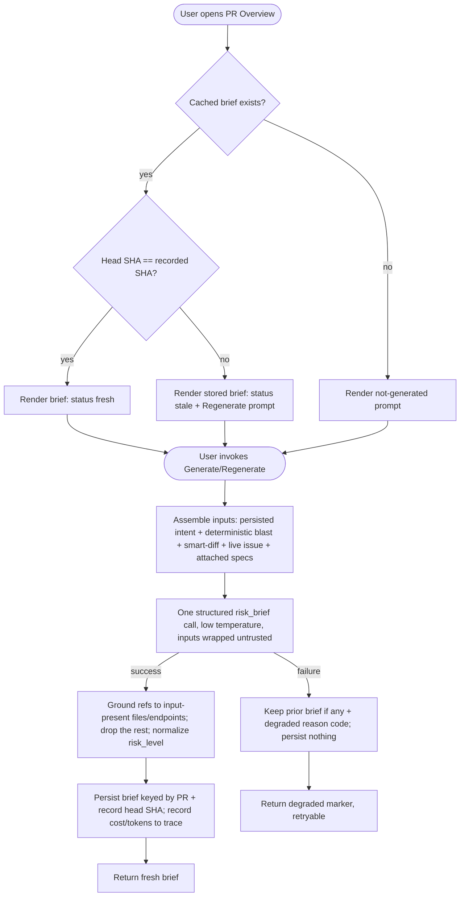

# Spec: Why+Risk Brief (PR Brief)   |   Spec ID: SPEC-2026-07-10-why-risk-brief   |   Status: draft
Supersedes: none

## Problem & why

A reviewer opening a pull request today has to reconstruct the *point* of the change from
scattered surfaces: the Intent card (what the author says they did), the Blast Radius card
(what it touches), the Smart Diff (which files carry the logic), the linked issue (why),
and any project specs the change ought to respect. DevDigest already computes every one of
those artifacts, but nothing fuses them into a single "here is what this PR does, why, how
risky it is, and where to start reading" answer.

**Why+Risk Brief** (the "PR Brief") produces exactly that: one persisted, per-PR brief with
a plain-language *what* + *why*, a color-coded *risk level*, a short list of *risks* that
point at real files/endpoints, and a *review-focus* list of grounded `file:line` locations
("read these first"). The pedagogical shape mirrors the Onboarding Generator: **facts are
gathered by code, the judgement is written by the model.** The brief is assembled from
already-extracted **structured summaries and metadata** — the persisted PR intent, the
deterministic blast-radius summary, the smart-diff role/statistics, the linked issue, and
the attached Project Context specs — and then **one** structured model call turns those
facts into the brief. Crucially, **the raw diff hunks are NOT an input**: grounding the
brief on pre-validated structured data keeps the call cheap and forces the model to reason
over facts the pipeline already trusts, not over unbounded change text.

Grounding against this tree confirms what already exists (reuse, do not rebuild):

- **Inputs are all already-computed reads.**
  - Intent (L03) is persisted in the `pr_intent` store and read cheaply with no model call
    (`server/src/modules/reviews/intent.service.ts:114-120`); its one model call happens at
    classify time, not here. Shape `{ intent, in_scope[], out_of_scope[] }`
    (`contracts/brief.ts:9-14`).
  - Blast radius (L04) is fully deterministic, compute-on-read, no model call
    (`server/src/modules/blast/service.ts:17-39`), index-backed, and already includes
    `prior_prs`. Shape carries `changed_symbols[]`, `downstream[]` (callers, endpoints,
    crons), a `summary`, and `prior_prs[]` (`contracts/brief.ts:33-62`).
  - Smart Diff (L03) is deterministic, compute-on-read, no model call
    (`server/src/modules/reviews/smart-diff.service.ts:16-44`): files grouped by role
    (`core`/`wiring`/`boilerplate`) with `additions`/`deletions`/`finding_lines`, plus a
    `split_suggestion` (`contracts/brief.ts:83-115`).
  - The linked issue is fetched **live** from GitHub (regex over the PR body, then
    `github.getIssue`) and is **not persisted** anywhere today
    (`intent.service.ts:142-165`); `PrDetail.linked_issue` is derived at fetch time but
    discarded on import.
  - Project Context specs (L05) are **manually attached** to the agent and its enabled
    skills — there is no automatic per-PR relevance selection; the runtime union/dedupe/
    fresh-read lives in `resolveProjectContext` (`reviews/project-context.ts:68-90`).
- **The model feature slot exists.** `risk_brief` is a registered feature-model
  (`contracts/platform.ts:59-64`, default `openai/gpt-4.1`), resolved via
  `resolveFeatureModel(container, workspaceId, 'risk_brief')`.
- **The cache table exists but is unwired.** A `pr_brief` table (`{ prId PK, json jsonb }`,
  `db/schema/reviews.ts:57-62`) is scaffolded with zero repository/service/route usage. It
  is keyed by PR only, with **no head-SHA column** — a freshness policy against the PR head
  must be designed here (mirroring how Onboarding keys by indexed SHA).
- **Client primitives exist.** `CircularScore` (the score ring), `RunCostBadge` (the
  `$0.014 · 8.2K→1.3K` readout), `MonoLink` + `githubBlobUrl` (`file:line` deep links), and
  the Onboarding fresh/stale-badge + Regenerate header pattern are all reusable; the new
  `PrBriefCard` slots above the existing `IntentCard`/`BlastRadiusCard` row on the Overview
  tab.

**Scaffold drift — RESOLVED 2026-07-10 (do not treat the existing `PrBrief` as the output
taxonomy).** The scaffolded `PrBrief = { intent, blast, risks, history }`
(`contracts/brief.ts:118-124`) is the aggregated **input** bundle. It has **no** `what`,
`why`, `risk_level`, or `review_focus` fields, so it does **not** match the requested brief
**output** `{ what, why, risk_level, risks[], review_focus[] }`. Also `Risk.file_refs` are
bare strings with **no line numbers** (`contracts/brief.ts:73`), yet the review-focus list
needs `file:line`. **Product decision:** define a **net-new, separate output contract** with
line-bearing references on both `review_focus[]` and the output `risks[]`, and leave the
existing `PrBrief` input bundle **untouched** (see Contracts).

## Goals / Non-goals

- Goal: On user action, generate and persist a per-PR brief with a plain-language `what`, a
  `why`, a `risk_level`, a short `risks[]` list, and a `review_focus[]` list of grounded
  `file:line` locations.
- Goal: Assemble the brief's input **only** from already-computed structured artifacts —
  persisted intent, deterministic blast summary, smart-diff role/stats, linked issue, and
  attached Project Context specs — and **never** from the raw diff hunks.
- Goal: Make exactly **one** structured model call per generation; reading a cached brief
  makes zero model calls.
- Goal: Ground every emitted `file:line`/endpoint reference against the real files/endpoints
  present in the assembled inputs; drop any reference the inputs do not contain.
- Goal: Cache the brief per PR keyed by the PR head SHA it was generated against; mark it
  stale when the head advances; let the user Regenerate on demand.
- Goal: Render the brief in a `PrBriefCard` on the PR Overview tab — a color-coded risk
  banner with the `what`/`why` summary, a Regenerate control, the brief call's cost/token
  readout, and a "Review focus — read these first" list of `file:line` links.
- Goal: Make the single model call auditable — record its cost, tokens, and model into the
  run trace/logs — and additionally surface that cost/token readout in the card (the mockup
  shows it; this diverges from Onboarding, which hides cost).
- Goal: Fail soft — on a model-call failure, a missing input, or an un-analyzable PR, never
  return an error card or an empty screen; preserve any prior cached brief and offer retry.
- Non-goal: **Reading the raw diff hunks** into the brief input. Explicitly excluded — the
  brief is grounded on structured summaries only.
- Non-goal: **Computing a numeric PR score or a review verdict inside the brief** (confirmed
  2026-07-10). The PR score ring (`CircularScore`), the "Request changes" verdict, and the "N
  findings · M blockers" counts shown in the mockup are owned by the **existing review
  pipeline** (`review.score` + findings), not by this feature. The brief's `risk_level` is an
  **independent** brief-authored judgement; the card makes no attempt to reconcile
  `risk_level` with the review score/verdict (AC-11).
- Non-goal: **Auto-selecting "relevant" Project Context specs per PR** (confirmed
  2026-07-10). No such relevance mechanism exists; the brief reuses the same
  manually-attached Project Context document set as review runs — supplied by the workspace's
  **default review agent** (whose model override the brief also honours). No new selection
  intelligence.
- Non-goal: **A second model call to (re)classify intent.** If a PR has no persisted intent,
  the brief proceeds without it rather than triggering an intent classification.
- Non-goal: **Streaming/SSE progress.** Generation is synchronous on the POST (mirroring
  `POST /pulls/:id/intent`), with a simple loading state on the Regenerate control.
- Non-goal: **Languages other than English** in v1.
- Non-goal: Changing the injection-guard / `<untrusted>`-wrapping mechanism, the
  `groundFindings()` review gate, or any other pipeline invariant.

## User stories

- US-1: As a reviewer, I want a one-glance "what this PR does, why, and how risky" brief, so
  that I grasp the change before reading a line of diff.
- US-2: As a reviewer, I want a "read these first" list of grounded `file:line` locations, so
  that I start at the riskiest spots instead of the top of the file list.
- US-3: As a reviewer, I want the risk level color-coded and a short list of concrete risks
  referencing real files/endpoints, so that I can triage at a glance and trust the claims.
- US-4: As a maintainer, I want the brief grounded in already-extracted facts (intent, blast,
  smart-diff, issue, specs), not the raw diff, so that it is cheap and stays on pre-validated
  data.
- US-5: As a returning reviewer, I want the brief cached per PR, regenerable on demand, and
  marked stale when the PR head advances, so that I trust it against the current code.
- US-6: As a maintainer paying for the model, I want exactly one bounded, auditable model
  call per generation with its cost visible, so that cost is predictable.
- US-7: As a reviewer whose model call failed or whose PR is not yet analyzable, I want a
  useful degraded state with any prior brief preserved, not an error or an empty card.

## Assumptions

- The brief reuses the **persisted** intent record and the **deterministic** blast/smart-diff
  reads — none of these three triggers a model call — if false (e.g. blast becomes an LLM
  step): the "one model call per brief" guarantee (AC-6) breaks and must be re-costed.
- The `pr_brief` cache table is repurposed for this output and gains a way to record the
  head SHA the brief was generated against (a column or a field inside its `json`) — if false
  (SHA cannot be recorded): the stale-on-new-head behaviour (AC-13/AC-14) cannot be honoured
  and every read would look fresh.
- The brief's output contract is a **new, separate** shape (confirmed 2026-07-10), mirrored
  byte-for-byte in `server/src/vendor/shared` and `client/src/vendor/shared` (dual-vendored
  two-file edit), leaving the existing `PrBrief` input bundle untouched — if false (the client
  cannot read the new fields): the card cannot render `what`/`why`/`risk_level`/`review_focus`.
- The linked issue is fetched live and may be unavailable offline / without a token — if
  false (a persisted issue store appears later): reuse it, no behaviour change.
- The set of Project Context specs the brief injects equals the review-time manual-attach set
  of the **default review agent** (its attached docs plus its enabled skills' attached docs),
  confirmed 2026-07-10 — if false (a PR-specific selector is expected later): the input set
  would need a new selector, a scope change beyond v1.

## Acceptance criteria (EARS)

### Assembly & inputs

- AC-1: WHEN a brief is generated for a PR, the system **shall** assemble its model input
  **only** from the persisted intent (if present), the deterministic blast-radius summary,
  the smart-diff role/statistics, the linked issue (if fetchable), and the attached Project
  Context specs — and **shall not** include the PR's raw diff hunks.
  _(observable: the assembled prompt contains the structured summaries and carries no
  raw diff-hunk text; a PR with large hunks produces an input whose size is bounded by the
  summaries, not by the diff)_
- AC-2: WHEN assembling inputs, the system **shall** read the intent from its persisted store
  and **shall not** trigger an intent (re)classification; IF no intent is persisted, THEN the
  system **shall** proceed without it and mark intent absent in the assembled input.
  _(observable: generating a brief triggers zero `review_intent` model calls; for a PR with
  no stored intent the brief still generates and no intent classification runs)_
- AC-3: The Project Context specs injected into the brief **shall** be exactly the
  manual-attach set of the workspace's **default review agent** used at review time (that
  agent's attached documents unioned with its enabled skills' attached documents,
  deduplicated by repo-relative path), read fresh from the clone, with no PR-specific
  relevance filtering.
  _(observable: the specs injected into the brief match the paths `resolveProjectContext`
  returns for the default review agent's configuration; changing an attachment changes the
  injected set)_
- AC-4: IF the linked issue cannot be resolved or fetched (no reference, offline, no token,
  or GitHub error), THEN the system **shall** omit it and generate the brief from the
  remaining inputs without failing.
  _(observable: with GitHub unavailable the brief still generates at HTTP 200 with no issue
  content in the input; the request does not 5xx)_

### The one model call, grounding & determinism

- AC-5: WHEN a brief is generated, the system **shall** make exactly **one** structured model
  call resolving the model via the `risk_brief` feature-model, at a temperature that
  minimizes variation; reading an already-persisted brief **shall** make **zero** model calls.
  _(observable: one generation triggers exactly one provider structured call; a GET/read of a
  cached brief triggers none)_
- AC-6: WHEN a generation completes, the system **shall** record the call's cost, token
  counts, and model into the run trace/logs.
  _(observable: the persisted trace/log for the generation carries a non-null cost and token
  figures and the resolved model id)_
- AC-7: The system **shall** ground every `file`, `file:line`, or endpoint reference emitted
  in `risks[]` and `review_focus[]` against the references present in the assembled inputs
  (changed files from smart-diff/`pr_files`, blast callers' `file:line`, blast
  endpoints/crons, intent risk-area references), and **shall drop** any reference the inputs
  do not contain.
  _(observable: a brief whose model output cites a file absent from every input has that
  reference removed; every surviving `review_focus` entry resolves to a file present in the
  PR's changed-file set)_
- AC-8: The brief output structure — the presence and identity of the `what`, `why`,
  `risk_level`, `risks[]`, and `review_focus[]` fields, and `risk_level` being one of the
  fixed vocabulary {`high`, `medium`, `low`} — **shall** be deterministic and independent of
  model wording; a `risk_level` outside the vocabulary **shall** be rejected/normalized.
  _(observable: repeated generations on the same inputs yield the same field set and a
  `risk_level` always within the three values; an out-of-vocabulary level never reaches the
  response)_

### Output & rendering

- AC-9: WHEN a brief is read, the system **shall** return `what` (a plain-language summary of
  the change), `why` (its motivation), a `risk_level`, a `risks[]` list where each risk
  carries a title, an explanation, a severity, and grounded references to real
  files/endpoints, and a `review_focus[]` list where each entry carries a grounded
  `file:line` and a plain-language reason.
  _(observable: the response object carries all five fields; each `review_focus` entry has a
  `file`, a `line`, and a non-empty reason; each risk references at least one input-present
  file or endpoint)_
- AC-10: The `PrBriefCard` on the PR Overview tab **shall** render a risk banner whose color
  is driven by `risk_level`, the `what`/`why` summary text, a Regenerate control, the brief
  call's cost/token readout, and a "Review focus — read these first" list whose entries are
  `file:line` links that open the file at that line.
  _(observable: the card renders a color that maps to `risk_level`, the summary text, a
  Regenerate control, a cost/token readout, and one `file:line` link per `review_focus` entry)_
- AC-11: The brief's `risk_level` **shall** be an independent judgement — the system **shall
  not** derive it from, or reconcile it against, the review pipeline's score/verdict/blocker
  count. WHERE the card renders those review-derived figures (the PR score ring, the review
  verdict, or findings/blockers counts), it **shall** reuse the existing latest-review data
  for the PR **only when a completed review exists**, and **shall not** compute its own; WHERE
  no completed review exists, the card **shall** still render the brief without those figures.
  _(observable: `risk_level` is present and unchanged regardless of `review.score`; with a
  review present the ring shows the existing `review.score` alongside an independent
  `risk_level`; with no review the card renders `what`/`why`/`risk_level`/`review_focus` and
  no score ring, no 404)_
- AC-12: The `risk_level` **shall** be conveyed by text as well as color (not color alone).
  _(observable: the risk level is announced with a text label, readable with color removed)_

### Caching & freshness

- AC-13: WHEN a generation succeeds, the system **shall** persist the brief keyed by the PR
  and record the PR head SHA it was generated against; a subsequent read **shall** return the
  stored brief without a new model call.
  _(observable: after generation, a read returns the stored brief and triggers no model call;
  the stored record carries the head SHA it was generated against)_
- AC-14: WHILE the persisted brief's recorded head SHA equals the PR's current head SHA, the
  system **shall** report it fresh; IF the head SHA has advanced past the recorded SHA, THEN
  the system **shall** report it stale while still returning the stored brief.
  _(observable: before a new push the read status is fresh; after the PR head advances the
  read status is stale and the stored brief still renders with a stale marker)_
- AC-15: WHEN a user invokes Regenerate, the system **shall** force a fresh single-call
  generation against the current head SHA and replace the stored brief.
  _(observable: Regenerate triggers exactly one new structured call and the stored head SHA
  updates to the current head)_

### Failure / degraded

- AC-16: IF the structured model call fails or times out, THEN the system **shall not** 5xx,
  **shall not** persist a partial brief, **shall** preserve any prior stored brief, and
  **shall** return a degraded marker with a closed reason code that the client maps to a
  message; the action **shall** be retryable via Regenerate.
  _(observable: with the provider forced to error, the request returns HTTP 200 with a
  degraded reason; a previously stored brief is still returned; no new partial record is
  written)_
- AC-17: WHEN a brief is requested for a PR that has never been generated, the system
  **shall** return an explicit "not generated yet" state rather than an error or an empty
  body.
  _(observable: a read for a never-generated PR returns a not-generated marker at HTTP 200,
  and the card renders a generate prompt)_

### Security

- AC-18: WHEN intent text, the linked issue body, Project Context spec text, and blast/
  smart-diff-derived strings are placed into the generation prompt, the system **shall** wrap
  them as untrusted via the existing `<untrusted>` mechanism and keep the injection guard, so
  none of them can act as instructions.
  _(observable: the assembled prompt fences these inputs in `<untrusted>` and retains the
  guard; a linked issue body containing "ignore previous instructions" does not change the
  brief's field set or structure)_
- AC-19: The brief generate/read routes **shall** resolve the caller's workspace via the auth
  context and scope every PR/brief query by workspace; a PR outside the caller's workspace
  **shall** resolve as not-found.
  _(observable: requesting or generating a brief for another workspace's PR returns 404, never
  another workspace's data)_
- AC-20: The generation route **shall** carry a per-route rate limit at least as tight as the
  intent/review precedent (max 10 per minute), being a cost-incurring single-model-call
  endpoint; the read route need not.
  _(observable: the generation route defines a rate-limit override and exceeding it returns
  429; the read route is unthrottled beyond the global default)_

## Edge cases

- PR has no persisted intent → brief generates from the remaining inputs, intent marked
  absent, no intent classification triggered. → AC-2.
- Linked issue unresolvable / GitHub offline / no token → issue omitted, brief still
  generates. → AC-4.
- No Project Context docs attached → brief generates with no `## Project context` input,
  exactly as a review with none. → AC-3.
- Model cites a file/line absent from every input → that reference is dropped; only
  input-present references survive. → AC-7.
- Model returns a `risk_level` outside {high,medium,low} → rejected/normalized before the
  response. → AC-8.
- Model call fails/times out mid-generation → HTTP 200 degraded marker, prior brief preserved,
  nothing partial persisted, retryable. → AC-16.
- PR head SHA advances after generation (a new push) → stored brief marked stale, still
  rendered, Regenerate offered. → AC-14, AC-15.
- Brief requested for a never-generated PR → explicit not-generated state, generate prompt.
  → AC-17.
- Concurrent Regenerate requests for the same PR → last write wins on the PR key; no partial
  brief persisted. → **accepted: last-write-wins** (a single structured call per request; the
  persist is all-or-nothing, so a half-written brief is never stored).
- No completed review for the PR → the card renders the brief without the review-derived score
  ring / verdict / findings counts. → AC-11.
- Linked issue body or a spec contains prompt-injection text → wrapped untrusted + guard;
  treated as data. → AC-18.
- Very large attached spec set / very large blast summary inflating the input → **accepted:
  no hard cap in v1**; the brief's own token readout (AC-6, surfaced per AC-10) makes volume
  visible so the user self-limits (mirrors the Project Context v1 decision).

## Non-functional

- Performance: reading a persisted, fresh brief **shall** issue no model call and return
  within a p95 of 500 ms (a cache/DB read plus the deterministic blast/smart-diff
  compositions, which are already sub-second reads). A generation is bounded by the single
  model call plus the deterministic input reads.
- Cost: exactly one structured model call per generation (AC-5); zero on read; the degraded
  path persists nothing and re-calls only on explicit Regenerate. Cost/tokens are recorded to
  the trace/logs (AC-6) and surfaced in the card (AC-10). The generation route is
  rate-limited to at most 10/min (AC-20).
- Security: intent, linked-issue, spec, and blast/smart-diff-derived text are untrusted and
  wrapped + guarded (AC-18); routes are workspace-scoped with cross-workspace PRs resolving as
  not-found (AC-19). The linked issue is fetched from the trusted GitHub API via the existing
  client (no PR-content-derived URL is fetched, so no SSRF surface is added). Full input
  bodies and issue/spec text are not logged wholesale; no secret-shaped field is stored (the
  brief holds only summaries and references).
- a11y: the card, risk banner, Regenerate control, and review-focus links **shall** meet WCAG
  2.1 AA — risk level conveyed by text plus color (AC-12), links keyboard-operable, Regenerate
  keyboard-operable and disabled while a generation is in flight.
- i18n: all new user-facing strings go through the client i18n layer (the existing `brief`
  namespace, extended with new keys); degraded reason codes map to i18n messages, never
  rendered as raw codes. Missing keys are a build-time error in this repo — new keys must
  exist before the card renders.

## LLM usage & determinism

- Inputs:
  - PR intent — [reused: the persisted `pr_intent` record via the intent read path; no model
    call here].
  - Blast-radius summary + prior PRs — [deterministic: the index-backed blast service,
    compute-on-read, no model call].
  - Smart-diff roles/statistics — [deterministic: the smart-diff service, compute-on-read, no
    model call].
  - Linked issue — [deterministic fetch: a live GitHub read via the existing client; not a
    model call; omitted on failure].
  - Project Context specs — [reused: the default review agent's review-time manual-attach set,
    read fresh from the clone; no model call].
  - The brief narrative + judgement — [new: exactly **1** structured model call **per brief
    generation** (i.e. per PR, per Regenerate); zero on read of a cached brief; zero on the
    degraded/failure path].
- On model failure: the system preserves any prior stored brief and returns a degraded marker
  with a closed reason code — never a bare error, never an empty card, never a 5xx. The result
  is retryable via Regenerate. Because the brief's `what`/`why`/`risk_level` are inherently
  model-authored, there is **no** deterministic narrative skeleton to fall back to (unlike
  Onboarding); the fallback is "keep the last good brief + reason code", not a synthesized one.
- Non-determinism: the same inputs do **not** guarantee identical prose (`what`, `why`, each
  risk explanation, each review-focus reason). What **is** deterministic and safe to assert
  on: the field set and the `risk_level` vocabulary (AC-8), that every emitted reference
  resolves to an input-present file/endpoint (AC-7), and that exactly one model call runs per
  generation (AC-5). Tests **shall not** assert on exact `what`/`why`/explanation/reason
  prose — only on structure, the grounded references, and call counts.

## Workflow



Every branch traces to a criterion: fresh/stale/not-generated split → AC-13/AC-14/AC-17;
input assembly without diff hunks → AC-1/AC-2/AC-3/AC-4; single grounded normalized call →
AC-5/AC-7/AC-8; persist by SHA + cost → AC-13/AC-6; model failure fallback → AC-16.

## Cross-module interactions

This feature spans **client**, **server**, and **reviewer-core** (via the shared
structured-call adapter and the `<untrusted>` mechanism).

- **client** adds the `PrBriefCard` to the PR Overview tab (above the existing
  `IntentCard`/`BlastRadiusCard` row): a risk banner colored by `risk_level`, the `what`/`why`
  summary, a Regenerate control (reusing the Onboarding fresh/stale + Regenerate pattern), the
  brief call's cost/token readout (reusing the existing cost-badge primitive), and a
  review-focus `file:line` list (reusing the existing mono-link + blob-url pattern). It reads
  the brief and triggers generate/Regenerate. New user-facing strings extend the existing
  `brief` i18n namespace.
- **server** owns a **net-new brief capability** on the pulls/reviews surface: a read route
  and a generate route (`POST /pulls/:id/brief`, `force` = Regenerate), following the existing
  `getContext` + workspace-scoped-404 + `IdParams` pattern and the intent/review rate-limit
  precedent (AC-19/AC-20). It reads the persisted intent, the deterministic blast and
  smart-diff compositions, the live linked issue, and the attached specs; assembles the
  untrusted-wrapped input; makes the single `risk_brief` structured call; grounds and
  normalizes the output; persists it in the (currently unwired) `pr_brief` store with the
  generated-against head SHA; and records cost/tokens to the trace. The store needs new
  read/write helpers and a way to record the head SHA — neither exists today.
- **reviewer-core** contributes the structured-output plumbing already in use (the structured
  call via the `LLMProvider` port and the `<untrusted>`/injection-guard mechanism). **No
  reviewer-core change is required** — this feature consumes it. Note the review pipeline's
  `groundFindings()` gate is a *findings-over-diff* gate and does **not** apply to the brief
  (which excludes the diff); the brief performs its own input-reference grounding (AC-7).

Failure contract: a missing input (no intent, no issue, no specs), a degraded index behind
the blast summary, or a failed model call is **fail-soft** — the server returns a brief or a
degraded marker at HTTP 200 (AC-4/AC-16/AC-17), never a 5xx and never an empty card. A
cross-workspace PR resolves as 404 (AC-19).

**Dual-vendored contract note:** the new brief **output** shape (`what`/`why`/`risk_level`/
`risks[]`/`review_focus[]`) plus the response freshness metadata is a **two-file edit**
mirrored byte-for-byte in `server/src/vendor/shared/contracts` and
`client/src/vendor/shared/contracts`. A change to the shared contracts is by construction a
server-AND-client edit — budget the fallout. The existing input-bundle `PrBrief` /
`Intent` / `BlastRadius` / `SmartDiff` / `Risk` shapes are reused as inputs **unchanged**
(confirmed 2026-07-10); the output `risks[]` uses a distinct, line-bearing `BriefRisk` shape
rather than extending the input `Risk`.

```mermaid
sequenceDiagram
    participant UI as client (PrBriefCard)
    participant SRV as server (brief capability)
    participant INT as intent store (persisted)
    participant DET as blast + smart-diff (deterministic)
    participant GH as GitHub (linked issue)
    participant CTX as Project Context (attached specs)
    participant LLM as LLM provider

    UI->>SRV: GET brief for PR (workspace-scoped)
    SRV->>SRV: load cached brief; compare head SHA
    SRV-->>UI: brief + {status: fresh|stale} OR not-generated
    UI->>SRV: POST generate / regenerate
    SRV->>INT: read persisted intent (no reclassify)
    SRV->>DET: read blast summary + smart-diff stats
    SRV->>GH: fetch linked issue (fail-soft)
    SRV->>CTX: read attached specs fresh
    SRV->>SRV: assemble inputs (no diff hunks), wrap untrusted
    SRV->>LLM: one structured risk_brief call (low temp)
    alt call succeeds
        LLM-->>SRV: what/why/risk_level/risks/review_focus {cost, tokens}
        SRV->>SRV: ground refs to input-present files; drop the rest; normalize risk_level
        SRV->>SRV: persist keyed by PR + head SHA; record cost/tokens
        SRV-->>UI: fresh brief
    else call fails
        LLM-->>SRV: error
        SRV-->>UI: degraded marker + prior brief (persist nothing)
    end
```

## Contracts

Shapes only — field names/direction/optionality/valid values, not implementation. Existing
input shapes are noted so the planner reuses them.

- **Brief output** (server → client, **net-new, separate, dual-vendored** — confirmed
  2026-07-10; the existing input-bundle `PrBrief` is left untouched):
  `{ what: string; why: string; risk_level: "high" | "medium" | "low"; risks: BriefRisk[];
  review_focus: ReviewFocusItem[] }`. `ReviewFocusItem = { file: string; line: integer;
  reason: string }`, where `file` resolves to a PR changed-file and `line` is a real line in
  the assembled inputs (AC-7). `BriefRisk` carries a title, an explanation, a severity in the
  same {high,medium,low} vocabulary, and **line-bearing** grounded references to real
  files/endpoints (`{ file: string; line?: integer }` or an endpoint string) — a distinct
  shape from the scaffolded input `Risk`, whose `file_refs` are bare, line-less strings and
  which is **not** reused for the output.
- **Brief response metadata** (server → client, net-new): `{ status: "fresh" | "stale" |
  "not_generated" | "degraded"; degradedReason?: <closed reason code>; headSha: string;
  generatedAt: timestamp; cost?: { usd: number; tokensIn: integer; tokensOut: integer;
  model: string } }`. Drives the stale/not-generated/degraded states and the card's cost
  readout. The `cost` here is the **brief generation call's own** cost/tokens (confirmed
  2026-07-10 — not the review run's). `degradedReason` is one of a closed set (e.g.
  `model_failed`, `no_inputs`), mapped to i18n on the client.
- **Generate request** (client → server): PR-scoped, `{ force?: boolean }` where `force =
  true` is Regenerate. A PR outside the caller's workspace returns a handled 404 (AC-19).
- **Persisted brief** (server-internal store): the produced brief plus the head SHA it was
  generated against and generation metadata, keyed by PR. The head SHA is net-new to the
  existing `pr_brief` store, which today keys by PR only.
- **Reused input shapes** (server-internal): the persisted `Intent`, the deterministic
  `BlastRadius` (incl. `prior_prs`), and the `SmartDiff` — all read as-is; plus the live
  linked-issue text and the attached-spec texts (via the existing Project Context resolution).
  None of these change shape.

## Untrusted inputs

**Yes — this feature feeds repo/PR-derived and third-party text to the model.** The intent
text, the **linked issue body** (authored by anyone who can open an issue), the Project
Context spec text (authored by anyone with repo write access), and the blast/smart-diff-derived
strings (file paths, symbol names, summaries) all originate from content DevDigest does not
control. They must be treated as data, never instructions:

- Every such input is wrapped in the existing `<untrusted>…</untrusted>` mechanism and the
  unconditional injection guard remains appended to the system prompt (AC-18). No
  keyword/regex injection filter is added — the single-guard defence stands.
- The brief's own grounding rule is load-bearing: emitted `file:line`/endpoint references must
  resolve to references present in the assembled inputs, and unresolvable ones are dropped
  server-side (AC-7) — the model cannot invent a location the pipeline has not already
  validated.
- The linked issue is read via the existing trusted GitHub client, not from a PR-content-
  derived URL, so no SSRF surface is introduced.
- The generate route is workspace-scoped (AC-19) and rate-limited (AC-20) as an untrusted-
  input, cost-incurring endpoint.

## Rollout / migration

Additive, on-demand feature. The `pr_brief` store starts empty (and is unused today), so
there is nothing to backfill — a PR with no brief simply shows the "not generated yet" state
(AC-17). Recording the generated-against head SHA is a net-new field on that store; existing
rows do not exist, so there is no legacy shape to migrate. The new dual-vendored output
contract is additive. No existing stored shape changes; the intent, blast, smart-diff, and
Project Context surfaces are read-only consumers here and are untouched. The feature is safe
to ship dark (it does nothing until a user generates a brief) and the generation route can be
gated independently of the read route.

## Traceability

| Source | Covered by |
|--------|------------|
| US-1: one-glance what/why/risk brief | AC-9, AC-10 |
| US-2: grounded "read these first" list | AC-7, AC-9, AC-10 |
| US-3: color-coded risk + concrete risks referencing real files | AC-9, AC-10, AC-12 |
| US-4: grounded on structured facts, not the raw diff | AC-1, AC-2, AC-3 |
| US-5: cached per PR, regenerable, stale on new head | AC-13, AC-14, AC-15 |
| US-6: one bounded auditable model call, cost visible | AC-5, AC-6, AC-10, AC-20 |
| US-7: useful degraded state, prior brief preserved | AC-16, AC-17 |
| Edge: no persisted intent | AC-2 |
| Edge: linked issue unavailable | AC-4 |
| Edge: no attached specs | AC-3 |
| Edge: model cites absent file/line | AC-7 |
| Edge: out-of-vocabulary risk_level | AC-8 |
| Edge: model call fails/times out | AC-16 |
| Edge: PR head advances after generation | AC-14, AC-15 |
| Edge: never-generated PR | AC-17 |
| Edge: no completed review for the PR | AC-11 |
| Edge: injection text in issue/spec | AC-18 |
| Edge: concurrent Regenerate | accepted: last-write-wins |
| Edge: oversized input set | accepted: no hard cap, volume visible via cost readout |
| Workspace scoping / cost control | AC-19, AC-20 |

## Open questions

None remaining — all four were resolved with the product owner on 2026-07-10 before hand-off
to `implementation-planner`:

- **RESOLVED (Q1) — output taxonomy / naming vs the scaffold.** Define a **net-new, separate**
  brief output contract (`BriefRisk` + `ReviewFocusItem`, line-bearing references) and leave
  the existing input-bundle `PrBrief` and its line-less `Risk` **untouched**. Reflected in the
  Problem scaffold-drift note, Assumptions, and Contracts.
- **RESOLVED (Q2) — risk_level vs PR score / verdict / blockers.** The brief's `risk_level` is
  an **independent** judgement; the card reuses the existing review score/verdict/findings
  **only when a completed review exists** and never reconciles them with `risk_level`.
  Reflected in the score Non-goal and AC-11.
- **RESOLVED (Q3) — which specs the brief injects.** The brief reuses the **default review
  agent's** manually-attached Project Context set (its attached docs plus its enabled skills'
  attached docs) and that agent's model override; no automatic per-PR spec selection in v1.
  Reflected in the spec-selection Non-goal, Assumptions, AC-3, and the LLM inputs list.
- **RESOLVED (Q4) — cost readout source.** The card's cost/token readout is the **brief
  generation call's own** cost/tokens, not the review run's. Reflected in the Brief response
  metadata contract.
