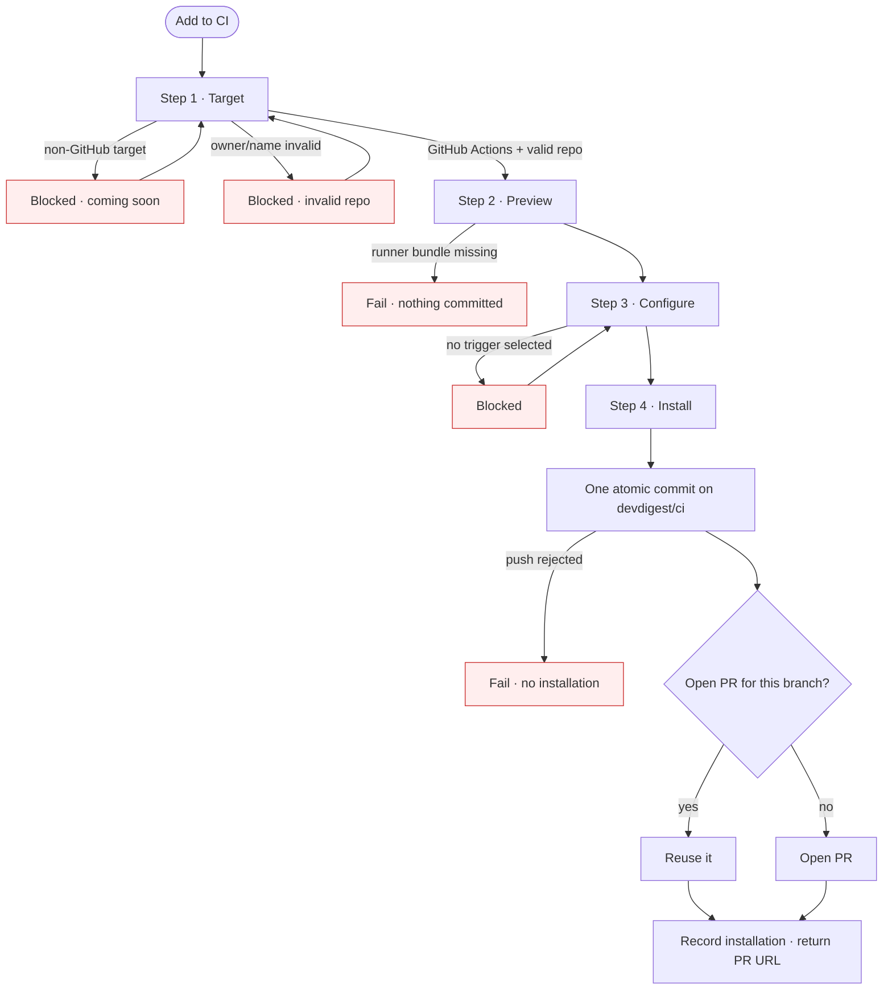
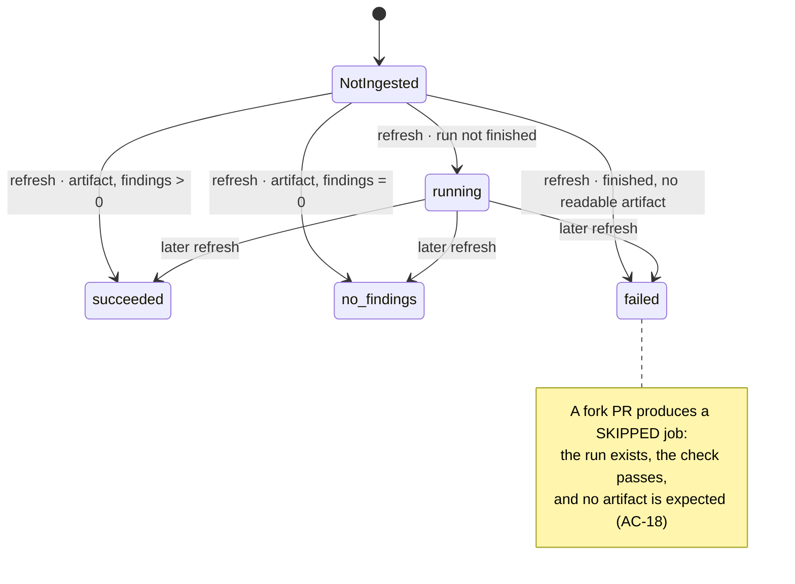
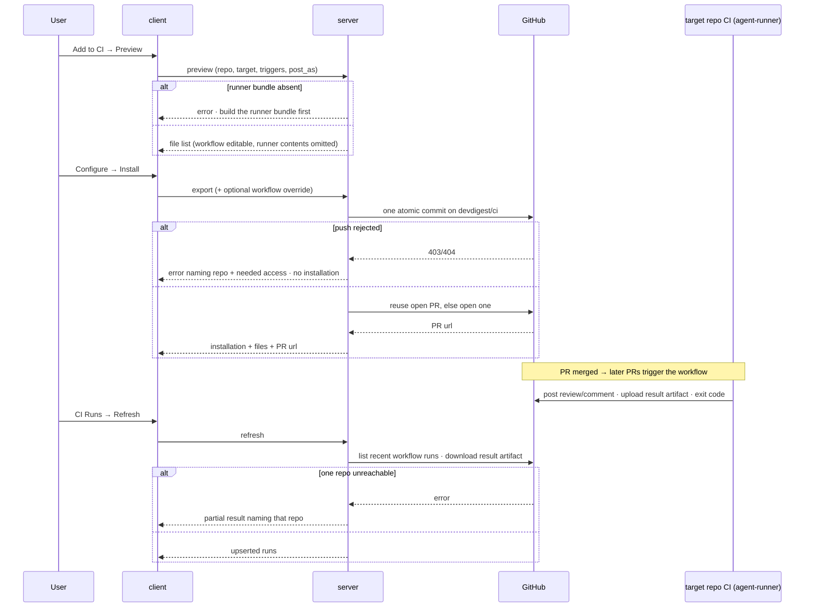

# Spec: Export to CI   |   Spec ID: SPEC-2026-07-21-export-to-ci   |   Status: draft
Supersedes: none

## Problem & why

A tuned review agent — model + system prompt + linked skills + gate policy — only runs when a
human opens the studio and presses **Run Review**. The value of tuning an agent is realised on
*every* pull request, automatically, in the repository the team actually works in.

Everything needed to run that agent outside the studio already exists: the CI runner is built and
tested, it reads a checked-in agent manifest plus skill files, runs the same `reviewer-core`
pipeline the studio runs, and computes its verdict and exit code deterministically. What is
missing is the bridge: nothing in the product **generates** that checked-in configuration, ships
it to a target repository, or shows the resulting CI runs back to the user.

This spec defines that bridge — an export wizard, the generated bundle, the pull request that
installs it, and a manual refresh that pulls CI results back into the studio.

It is deliberately under-engineered. The goal is the shortest path to "a PR in my repo gets
reviewed by my agent, and I can see it happened". Mechanisms that would only pay off once real
usage is understood (background ingestion, versioning, multi-agent repos, non-GitHub targets) are
Non-goals, listed explicitly so a later iteration can pick them up on evidence rather than guess.

## Goals / Non-goals

**Goals**

- Serialize a tuned agent into a manifest that the studio writes and the CI runner reads —
  **one contract, two consumers**, no "slightly different prompt version in CI".
- A 4-step **Export Wizard** (Target → Preview → Configure → Install) reachable from a new **CI**
  tab on the agent page.
- Install by opening a pull request in the target repository: one atomic commit onto a
  `devdigest/ci` branch, never a direct write to the base branch.
- A generated GitHub Actions workflow that is **self-contained** (it runs the runner shipped in
  the same PR, not a marketplace action) and **explainable line by line** by the user.
- Closing the "lethal trifecta" in CI: the agent reads an untrusted diff *and* holds write access
  to a PR, so the workflow gets minimum permissions, secrets from Actions Secrets only, and no
  secrets on fork PRs.
- A **CI Runs** page and a per-agent run history, populated by a **manual Refresh** that reads the
  target repositories' Actions runs and their result artifacts.
- A **Fail CI on** selector on the CI tab, and a per-repository **Update CI config** action that
  pushes a regenerated agent config to that repository's existing branch/PR.

**Non-goals** (deliberately cut — revisit with real usage)

- **CircleCI, Jenkins, Generic CLI.** Rendered as disabled "coming soon" cards; no file generation.
  Only `target: 'gha'` is implemented.
- **"Copy files as a zip"** degraded install path. The card is shown disabled ("coming soon"); the
  PR path covers the need, and a zip must also carry the multi-megabyte runner bundle. See
  *Open questions*.
- **Background ingestion** — no polling loop, no webhook, no GitHub App, no queue, no retry
  machinery. Refresh is a button.
- **Secret verification.** GitHub's API cannot be asked whether a repository secret exists with an
  ordinary token; the wizard therefore never claims to know.
- **Workflow versioning.** No stored "workflow version" per installation, no upgrade prompt. The
  runner bundle is refreshed only by running the wizard again.
- **More than one exported agent per repository.** The runner requires exactly one manifest under
  `.devdigest/agents/`; a repo-level agent matrix is out of scope.
- **Persisting the wizard's trigger/post-as choices.** They shape the generated workflow at export
  time only; `Update CI config` therefore never rewrites the workflow (see AC-30).
- **Updating several repositories in one action.** The mockup places a single `Update CI config`
  control in the CI-tab header, which for an agent installed in N repositories means a fan-out with
  per-repository partial failure to design, report and test. Simplified to one control per
  installation row (AC-31): identical behaviour for the common single-repository case, and no
  partial-success state to model. Revisit if agents routinely land in many repositories.
- **The mockup's `Stats` tab, and the `Memory` / `Multi-Agent Review` / `Agent Performance` nav
  items.** They belong to other features; only `CI Runs` is added to the new `GLOBAL` nav section.
- **Touching the multi-run service or the PR feed.** This feature owns the CI engine and its
  routes, the CI Runs page, and the agent CI tab — nothing else.
- **A browser flow fixture** for the wizard in this iteration.

## User stories

- **S1** — As an agent author, I want to deploy a tuned agent onto a repository's pull requests,
  so that every PR is reviewed without anyone opening the studio.
- **S2** — As a reviewer of that change, I want the CI configuration to arrive as a pull request,
  so it goes through review like any other code.
- **S3** — As a security-minded engineer, I want to read the generated workflow and understand
  every line, so that granting an AI write access to my PRs is a decision I can defend.
- **S4** — As a team lead, I want a PR with a critical finding to be unmergeable, so the gate is
  real and not advisory.
- **S5** — As an agent author, I want to change the blocking policy after installation and push it
  to the repo, so tuning does not require re-running the whole wizard.
- **S6** — As a user, I want to see the reviews that ran in CI — per repository and globally —
  so I know the deployment is alive and what it costs.

## Assumptions

- The prebuilt runner bundle exists on the server's filesystem at export time — if false: export
  fails loudly (AC-8) rather than shipping a broken workflow.
- The runner bundle is a few megabytes and fits GitHub's blob-creation limits (measured
  2026-07-21: ~1.5 MB entrypoint plus two small files) — if false: the
  export surfaces GitHub's own rejection and nothing is committed (AC-25); no size pre-check is
  built in this iteration.
- The configured GitHub credential can push branches and open PRs in the target repository — if
  false: export fails with a permission-specific message and no installation is recorded (AC-25).
- The target repository does not already contain a different agent manifest under
  `.devdigest/agents/` — if false: the exported workflow's first CI run fails with the runner's
  "expected exactly one manifest" error; the studio does not detect this in advance.
- The `ci_installations` / `ci_runs` tables are effectively empty in every existing environment
  (no feature has ever written them) — if false: the additive columns in *Rollout* read null for
  pre-existing rows and the UI must tolerate that.
- Result artifacts are still retrievable when Refresh runs (GitHub expires them, 90 days by
  default) — if false: those runs ingest as `failed` with null metrics (AC-33), which is
  indistinguishable from a genuinely failed run; accepted for this iteration.
- Reading Actions workflow runs and downloading run artifacts is within the studio's existing
  GitHub integration's reach — if false: the Refresh feature cannot ship as specified and the
  integration must be extended before it can.

## Acceptance criteria (EARS)

### Wizard entry and Target step

- **AC-1**: WHEN the user activates **Add to CI** on an agent's CI tab, the system **shall** open a
  modal wizard with four ordered steps — Target, Preview, Configure, Install — starting on Target
  with GitHub Actions preselected.
  _(observable: the modal renders the 4-step stepper with "Target" current and the GitHub Actions
  card in the selected state)_
- **AC-2**: WHILE the Target step is shown, the system **shall** render CircleCI, Jenkins and
  Generic CLI as disabled cards labelled "coming soon", and **shall not** allow the wizard to
  advance unless GitHub Actions is the selected target.
  _(observable: clicking any non-GitHub card leaves the selection on GitHub Actions and the step
  unchanged; "Continue" moves to Preview only with GitHub Actions selected)_
- **AC-3**: The Target step **shall** carry a free-text target-repository field in `owner/name`
  form, pre-filled with the active workspace repository and editable to any other value.
  _(observable: the field renders pre-filled; typing a different `owner/name` is accepted and is
  the repository named in the Install step's summary text)_
- **AC-4**: IF the target-repository value is empty or is not of the form `owner/name`, THEN the
  wizard **shall** block Continue, and the server **shall** reject an export or preview request
  carrying it with a validation error before any call to GitHub is made.
  _(observable: "Continue" stays inert for `acme`, `acme/`, `https://github.com/acme/x`; a direct
  request with such a value returns a 4xx validation error and no branch/commit appears)_

### Preview and the generated bundle

- **AC-5**: WHEN the wizard enters Preview, the system **shall** obtain the full list of files that
  would be committed, and **shall** perform no write of any kind to the target repository.
  _(observable: after visiting Preview and closing the wizard, the target repo has no
  `devdigest/ci` branch, no new commit, and no PR; no installation row exists)_
- **AC-6**: The generated bundle **shall** consist of exactly: one agent manifest at
  `.devdigest/agents/<agent-slug>.yaml`; one markdown file per enabled linked skill at
  `.devdigest/skills/<skill-slug>.md`; an empty `.devdigest/memory.jsonl`; the workflow at
  `.github/workflows/devdigest-review.yml`; and **every file the runner build produced**,
  each under `.devdigest/runner/`, with `.devdigest/runner/index.js` as the entrypoint the
  workflow invokes.
  _(observable: the Preview file list and the resulting PR's changed-files list contain exactly
  those paths and no others; an agent with two enabled skills and a three-file runner build
  yields 4 + 3 = 7 files)_
- **AC-6a**: The runner **shall** be shipped as the complete set of files its build emits,
  never as the entrypoint alone.
  _(observable: `.devdigest/runner/package.json` declaring the module type is present in the
  PR, and `node .devdigest/runner/index.js` in a repository whose own `package.json` does not
  declare that type starts the runner and reaches its own manifest-loading stage, rather than
  aborting on a module-syntax error)_

  **Why this is an AC and not an implementation detail.** Verified by execution 2026-07-21:
  shipping the entrypoint alone fails with `SyntaxError: Cannot use import statement outside
  a module` on line 1, in *every* target repository whose `package.json` does not opt into ES
  modules — which is most of them. Node resolves a `.js` file's module type from the nearest
  `package.json`, and in a target repo that is the target repo's own. The build emits a
  sibling `package.json` for exactly this reason, plus at least one lazily-loaded chunk that
  the entrypoint references only at runtime, so scanning the entrypoint for dependencies does
  not reveal it. A bundle-name allowlist is therefore forbidden: the file set must be whatever
  the build produced, or a future build that splits a new chunk silently ships a broken runner.
- **AC-7**: The generated manifest **shall** carry the agent's stored name, provider, model, system
  prompt, enabled skill slugs, strategy and `ci_fail_on`, and **shall** validate against the same
  manifest contract the CI runner validates with before use.
  _(observable: the committed YAML parses and validates against that contract; a CI run against it
  reaches the review stage instead of the runner's "failed validation" error)_
- **AC-8**: IF the prebuilt runner bundle is not present on the server when a preview or export is
  requested, THEN the system **shall** fail the whole operation with a message naming the missing
  artifact and the command that produces it, and **shall** commit nothing, open no pull request and
  persist no installation.
  _(observable: with the bundle deleted, the wizard shows an error naming the build command; the
  target repo has no `devdigest/ci` branch and the agent still shows zero installations)_
- **AC-9**: The preview **shall** mark the workflow file as the only editable file, and **shall
  not** transmit the runner bundle's contents.
  _(observable: only the workflow shows the "editable" affordance; selecting the runner entry shows
  a placeholder note instead of code, and the preview response payload stays under 1 MB)_
- **AC-10**: WHERE the export request carries an edited workflow text, the system **shall** commit
  that text at the fixed generated workflow path.
  _(observable: an edit made in Preview appears verbatim in the opened PR's workflow file)_
- **AC-10a**: IF the edited workflow text would run with the base repository's secrets against
  a pull request's own code, or would grant permissions beyond those the generated workflow
  declares, THEN the system **shall** reject the request and commit nothing.
  _(observable: an override containing `pull_request_target`, or `permissions: write-all`, or
  any write scope other than pull-requests — at workflow or job level — returns a 4xx and
  leaves the target repository with no branch, commit or pull request; the workflow this
  feature generates itself passes the same check unchanged, and ordinary edits such as a
  different runner image, a pinned Node version or an extra step are accepted)_

  **Why this exists.** The override is committed verbatim, so without it AC-14…AC-22 would
  be properties of the *renderer* rather than of the artifact that reaches the repository —
  and the malicious version would arrive inside a pull request titled "Add DevDigest CI
  review", among four legitimate generated files and a ~1.5 MB runner bundle, in the one
  file the wizard itself labels "editable". The check is deliberately narrow: it is not a
  workflow linter, because an editable field whose edits are mostly refused is not editable.
- **AC-11**: IF an export request supplies any file path, or any file content other than the single
  workflow override, THEN the system **shall** reject the request and commit nothing.
  _(observable: a request adding a `.git/config` or `../../x` entry returns a 4xx error and the
  target repo is unchanged)_
- **AC-12**: IF the supplied workflow text exceeds 64 KB, THEN the system **shall** reject the
  request and commit nothing.
  _(observable: a 65 KB override returns a 4xx error; a 63 KB one is accepted)_
- **AC-13**: The system **shall** generate byte-identical files for identical agent configuration
  and identical wizard input.
  _(observable: two consecutive previews of the same agent return identical file contents,
  including the manifest's key order)_

### Generated workflow — properties the user can read

- **AC-14**: The generated workflow's only trigger **shall** be `pull_request`, restricted to the
  trigger types selected in the Configure step.
  _(observable: the workflow text contains one `on:` key, `pull_request`, whose `types` match the
  selected chips; it contains no `issue_comment`, `workflow_dispatch`, `push` or `schedule`)_
- **AC-15**: The generated workflow **shall not** carry a path, branch or tag filter on its
  trigger.
  _(observable: the workflow text contains no `paths`, `paths-ignore`, `branches`,
  `branches-ignore`, `tags` or `tags-ignore` key — so every PR creates a workflow run and the check
  can be marked required without stranding a PR on "Expected")_
- **AC-16**: The generated workflow **shall never** use `pull_request_target`.
  _(observable: the string `pull_request_target` does not occur anywhere in the generated text)_
- **AC-17**: The generated workflow **shall** declare exactly two permissions — read access to
  repository contents and write access to pull requests — and no others.
  _(observable: the workflow's `permissions:` block lists precisely `contents: read` and
  `pull-requests: write`)_
- **AC-18**: IF the pull request's head branch lives in a fork, THEN the review job **shall** be
  skipped, while the workflow run itself is still created.
  _(observable: on a fork PR, the Actions tab shows the workflow run with the job marked "skipped",
  the check reports success to branch protection, and no comment or review is posted)_
- **AC-19**: The generated bundle **shall** reference the model credential only as an Actions
  secret named `OPENROUTER_API_KEY`, and **shall not** contain any credential value.
  _(observable: the workflow reads the key from `secrets.OPENROUTER_API_KEY`; no generated file —
  workflow, manifest, skills — contains a key-shaped literal, and the studio's logs of the export
  contain none either)_
- **AC-20**: The generated workflow **shall** pass the Configure step's "Post results as" choice to
  the runner as an environment variable on the run step, without adding a `post_as` field to the
  agent manifest contract.
  _(observable: choosing "PR comment" yields `DEVDIGEST_POST_AS: pr_comment` on the run step, the
  CI run posts a comment rather than a review, and the manifest YAML has no `post_as` key)_
- **AC-21**: The generated workflow **shall** invoke the runner committed in the same pull request
  directly, and **shall not** reference any third-party marketplace action.
  _(observable: the workflow's run step executes `node .devdigest/runner/index.js`; its only `uses:`
  entries are first-party GitHub actions for checkout, Node setup and artifact upload; the string
  `devdigest/review-action` does not occur)_
- **AC-22**: The generated workflow **shall** upload the runner's result file as a workflow
  artifact even when the review step exits non-zero.
  _(observable: a run whose gate triggered — job conclusion "failure" — still lists a downloadable
  artifact containing the result JSON)_
- **AC-23**: IF the Configure step's trigger selection is empty, THEN the wizard **shall** block
  Continue and the server **shall** reject the request.
  _(observable: deselecting all three trigger chips leaves "Continue" inert; a request with an empty
  trigger list returns a 4xx error)_

### Install

- **AC-24**: WHEN the user confirms Install, the system **shall** write every generated file to the
  target repository as ONE commit on a `devdigest/ci` branch created from the chosen base, and then
  open a pull request from that branch.
  _(observable: the repo gains exactly one new commit on `devdigest/ci` containing all generated
  files, and one open PR titled "Add DevDigest CI review"; the base branch has no new commit)_
- **AC-25**: WHERE an open pull request from the `devdigest/ci` branch already exists, the system
  **shall** reuse it instead of opening a second one.
  _(observable: exporting twice yields one open PR with two commits; the second export's response
  carries the same PR URL)_
- **AC-26**: IF GitHub rejects the write — repository not found, or the credential cannot push —
  THEN the system **shall** fail with a message naming the repository and the access it needs,
  persist no installation, and report no partial success.
  _(observable: exporting to a repository the token cannot write returns an error naming that repo;
  the agent's CI tab still shows no installation for it)_
- **AC-27**: WHEN an export succeeds, the system **shall** record exactly one installation per
  (agent, repository) pair, updating the existing record rather than adding a second.
  _(observable: exporting the same agent to the same repo twice leaves the CI tab showing one row
  for that repo, and the "Active in N repos" count unchanged)_
- **AC-28**: WHEN an export succeeds, the response **shall** carry the installation record, the
  list of committed files, and the pull request URL.
  _(observable: the Install step renders a working link to the opened PR)_

### Fail CI on, and Update CI config

- **AC-29**: WHEN the user changes "Fail CI on" on the CI tab, the system **shall** persist the new
  value on the agent and **shall not** write anything to any target repository.
  _(observable: the value survives a page reload; no new commit appears on `devdigest/ci`)_
- **AC-30**: WHEN the user activates **Update CI config** on ONE installed repository's row, the
  system **shall** commit a regenerated manifest and skill files onto that repository's
  `devdigest/ci` branch, reusing the open pull request where one exists, and **shall** leave the
  workflow file and the runner bundle untouched.
  _(observable: the PR gains a commit whose changed files are only under `.devdigest/agents/` and
  `.devdigest/skills/`; the workflow file's contents are unchanged and its blob is not in the diff)_
- **AC-31**: The update action **shall** address exactly one installation per activation — there is
  no action that updates several repositories at once.
  _(observable: an agent installed in three repositories renders three independent update controls;
  activating one leaves the other two repositories' branches untouched)_

### CI Runs ingest and display

- **AC-32**: WHEN the user activates **Refresh** on the CI Runs page, the system **shall** query
  GitHub Actions for each installation in the caller's workspace, bounded to the 20 most recent
  runs of the generated workflow per installation, and **shall** perform no ingestion at any other
  time.
  _(observable: with the API in front of a request log, refreshing issues one bounded listing per
  installation; leaving the page open for an hour issues none)_
- **AC-33**: WHEN a workflow run is ingested, the system **shall** derive its status
  deterministically: result artifact present with at least one finding → `succeeded`; artifact
  present with zero findings → `no_findings`; run completed with no readable artifact → `failed`;
  run not yet completed → `running` — never from the workflow run's own conclusion.
  _(observable: a run that blocked the PR — conclusion "failure", artifact present with findings —
  shows as `succeeded` with its finding count, not as `failed`)_
- **AC-34**: WHEN Refresh ingests a workflow run that was already ingested, the system **shall**
  update the existing record rather than create a second one, keyed by the pair (installation,
  workflow-run URL).
  _(observable: refreshing three times in a row leaves the row count unchanged and the newest
  status/metrics in place)_
- **AC-35**: IF a downloaded result artifact is missing, unreadable, or does not validate against
  the expected result shape, THEN the system **shall** record that run as `failed` with null
  findings, cost and duration, and **shall not** persist any field from the invalid payload.
  _(observable: a run whose artifact is hand-corrupted ingests as `failed` with empty metric cells;
  no fragment of the corrupt payload appears in the UI)_
- **AC-36**: WHEN a result artifact archive is downloaded, the system **shall** read only the single
  expected result entry from it, **shall not** write any entry to disk, and **shall** reject an
  archive larger than 5 MB.
  _(observable: an archive padded with a 50 MB extra entry is rejected and its run ingests as
  `failed`; no file from any archive appears on the server's filesystem)_
- **AC-37**: IF the GitHub call for one installation fails during Refresh, THEN the system **shall**
  still ingest the remaining installations and **shall** report which repositories could not be
  refreshed.
  _(observable: with one repo's access revoked, Refresh reports that repo by name and the other
  repos' new runs still appear in the table)_
- **AC-38**: The CI Runs page **shall** list only runs reachable from the caller's workspace
  through installation → agent → workspace, and the system **shall never** create a run record that
  is not attached to an installation.
  _(observable: a run belonging to another workspace's agent is absent from the list and its direct
  URL/identifier resolves as not found; every row in storage has a non-null installation reference)_
- **AC-39**: WHILE no CI run has been ingested, the CI Runs page **shall** show an empty state
  explaining that runs appear after an agent is exported to CI.
  _(observable: a fresh workspace renders the empty-state text, not a blank table or a spinner)_
- **AC-40**: WHEN CI runs exist, each row **shall** show the pull request number, the repository,
  the agent name, the status, the findings count, the cost, the duration, and a link to the GitHub
  Actions run.
  _(observable: a row renders all eight, and the link opens that run in the target repo's Actions
  tab)_

### Studio surfaces

- **AC-41**: The sidebar **shall** carry a `GLOBAL` section containing a `CI Runs` entry pointing at
  the CI Runs page, highlighted while that page is open.
  _(observable: the item renders under a `GLOBAL` heading; opening the page marks it active)_
- **AC-42**: The agent editor **shall** offer a `CI` tab, reachable both by clicking it and by
  deep-linking the tab in the URL.
  _(observable: the tab renders after Evals, and loading the agent URL with the CI tab selected
  opens on CI rather than falling back to Config)_
- **AC-43**: WHILE an agent has installations, the CI tab **shall** list one row per installed
  repository showing the repository, the target type, the most recent ingested run's status, and
  how long ago it ran, plus a count of repositories the agent is active in.
  _(observable: an agent installed in two repos shows two rows and "Active in 2 repos"; a repo with
  no ingested run shows a neutral "no runs yet" state rather than a stale status)_
- **AC-44**: The Configure step **shall** present the expected secrets as static reference
  information — the model key as one the user must add themselves, the GitHub token as one Actions
  provides — and **shall not** display any indicator that implies the system checked whether a
  secret exists.
  _(observable: the block renders the same text regardless of the repository chosen; no "ready" /
  "not set" status pill appears, and no request is made when the step opens)_
- **AC-45**: The Configure step **shall** explain that blocking a merge requires setting "Fail CI
  on" plus marking the check required in the repository's branch protection, and that no GitHub App
  is needed.
  _(observable: the callout renders that text; it does not say a GitHub App is required)_

### Cross-cutting

- **AC-46**: The system **shall** scope every CI operation to the caller's workspace, resolving the
  workspace through the auth port and responding "not found" for an agent, installation or run
  belonging to another workspace.
  _(observable: exporting or reading runs for another workspace's agent id returns 404, not 403 and
  not data)_
- **AC-47**: The system **shall** rate-limit the export endpoint to at most 10 requests per minute
  and the refresh endpoint to at most 6 requests per minute per workspace.
  _(observable: the 11th export within a minute returns 429; the 7th refresh within a minute
  returns 429)_
- **AC-48**: The generated bundle **shall not** contain any option that disables the grounding gate
  or that places pull-request title, body or diff outside the untrusted fence.
  _(observable: the manifest's keys are limited to those the shared manifest contract defines — none
  of which affect grounding or prompt fencing — and a CI run's posted findings are grounded ones)_
- **AC-49**: The CI message catalogue **shall** carry exactly one vocabulary for the CI tab and the
  export flow — the one the mockup uses — and the superseded strings **shall** be removed rather
  than left beside it.
  _(observable: the catalogue no longer contains the `publishDialog` block, the older `ciTab`
  wording, or the claim that blocking a merge requires a GitHub App; no rendered surface reads a
  removed key)_

## Edge cases

- Agent has no enabled skills → bundle contains no skill files; the manifest's skill list is empty
  and still validates. → AC-6, AC-7
- Agent's skill list changes after installation → **Update CI config** rewrites the manifest and
  skill files. A skill removed from the agent leaves a stale file in the target repo; the runner
  ignores files the manifest does not reference. → AC-30, accepted: no handling — deleting files in
  the target repo is extra machinery for a cosmetic problem.
- Runner bundle missing (it is gitignored and only produced by a build) → hard failure, nothing
  committed. → AC-8
- Target repository is a fork the user owns but was never imported into DevDigest → allowed; the
  repository field is free text. → AC-3
- Token cannot push to the target repository → clear failure, no installation. → AC-26
- Commit succeeds but opening the PR fails → the branch is left with the commit and no PR. Retrying
  the export fast-forwards the same branch and opens the PR. → accepted: no handling — the retry
  converges and a stray branch is harmless.
- Re-export of the same agent to the same repository → one installation, one PR, an extra commit.
  → AC-25, AC-27
- Exporting a **second, different** agent to a repository that already has one → the studio does not
  detect it; the next CI run fails with the runner's "expected exactly one manifest" error. →
  accepted: no handling — one agent per repository is an explicit Non-goal for this iteration.
- **Update CI config** when nothing changed → an extra commit with an identical tree. → accepted:
  no handling — a no-op commit is harmless and change detection is a mechanism for later.
- The exported PR contains the runner bundle, so the agent would review its own bundle → the runner
  already strips its own artifacts from the diff before reviewing. → accepted: handled upstream by
  the runner.
- Fork pull request → job skipped, run still created, check reports success. → AC-18
- Pull request that touches no files the agent cares about → the workflow still runs (no path
  filter), so the check can be required. → AC-15
- Model call fails inside CI → the run posts nothing and exits non-zero; no artifact is produced, so
  ingest records `failed` with null metrics. → AC-33, AC-35
- Gate triggers (blocking review) → job conclusion is "failure" but the artifact exists, so the run
  ingests as `succeeded`. → AC-33
- Workflow run still in progress when Refresh happens → ingested as `running`, replaced on the next
  refresh. → AC-33, AC-34
- Result artifact expired or deleted on GitHub → ingests as `failed`. → AC-35, and the *Assumptions*
  entry naming the ambiguity.
- Oversized or hostile result archive → rejected without extraction. → AC-36
- Result artifact from a compromised target repository carries a hostile `agent` string → it is
  validated, escaped and rendered as text. → AC-35, *Untrusted inputs*
- One repository unreachable during Refresh → partial success with named failures. → AC-37
- All trigger chips deselected → blocked. → AC-23
- Non-GitHub target chosen → cannot advance. → AC-2
- Malformed target repository value → blocked before any GitHub call. → AC-4
- Client attempts to smuggle an arbitrary file path into the export → rejected. → AC-11
- Installation exists but has never produced a CI run → the row shows "no runs yet". → AC-43

## Non-functional

- **Performance**: preview responds in under 3 s p95 (no network write); export completes in under
  15 s p95 for a bundle up to 5 MB; a refresh across up to 5 installations completes in under 20 s
  p95.
- **Payload**: the preview response stays under 1 MB — the runner bundle's contents are never sent
  to the browser (AC-9).
- **Rate limits**: export ≤ 10 req/min per workspace; refresh ≤ 6 req/min per workspace (AC-47).
- **Ingest bounds**: at most 20 workflow runs per installation per refresh; result archives over
  5 MB rejected (AC-32, AC-36).
- **Security**: the generated workflow declares exactly `contents: read` + `pull-requests: write`
  (AC-17); `pull_request_target` never appears (AC-16); fork PRs run no privileged job (AC-18); the
  model key is never read, stored or logged by this feature — only referenced by secret name
  (AC-19); no CI secret or token value reaches server logs, the API response, or the DB.
- **Accessibility**: the wizard meets WCAG 2.1 AA — the modal traps and restores focus, every step
  is completable by keyboard alone, the stepper's current step is exposed to assistive tech, and
  status pills carry a text label rather than colour alone.
- **i18n**: every new user-visible string is added to the message catalogue for every shipped
  locale (currently `en`); no literal strings in components.

## LLM usage & determinism

- **Inputs**:
  - Agent name, provider, model, system prompt, strategy, `ci_fail_on` — *[reused: the stored agent
    record]*.
  - Skill bodies — *[reused: the stored skills linked to the agent]*.
  - Workflow YAML, manifest YAML, memory placeholder — *[deterministic: string generation from the
    above plus the wizard's target/trigger/post-as input]*.
  - Runner bundle — *[deterministic: read from the server's prebuilt artifact]*.
  - CI run rows — *[deterministic: read from GitHub Actions runs and their result artifacts]*.
  - **[new: 0 LLM calls]** — the studio side of this feature makes no model call at all: not on
    preview, not on export, not on refresh.
- **Downstream cost (in the target repo, on the target repo's key)**: each qualifying pull-request
  event triggers **1 runner invocation**; that invocation issues **1 model call per PR** with the
  single-pass strategy, or **1 call per changed file plus 1 reduce call** with map-reduce. The
  wizard's Configure step does not change this count; the agent's strategy does.
- **On model failure**: the failure happens inside the target repo's CI, not in the studio. The
  runner posts nothing, writes no result artifact and exits non-zero — so the check fails visibly
  rather than silently approving. In the studio, that run appears on CI Runs with status `failed`
  and empty findings/cost/duration cells, never as a blank row or an exception (AC-33, AC-35). The
  user's recovery is GitHub's own "re-run job".
- **Non-determinism**: the studio side is fully deterministic and must be — the same agent and the
  same wizard input produce byte-identical files (AC-13), which is what makes preview trustworthy
  and lets tests assert on generated content exactly. The *review output* in CI is not repeatable
  and nothing here may assert on finding text; only the counts, the status mapping and the exit
  behaviour are stable, and those come from the deterministic gate, never from the model's
  self-reported verdict.

## Workflow

CI-side lifecycle of one exported workflow run, as the studio sees it:

Every branch above maps to AC-2, AC-4, AC-8, AC-23, AC-24, AC-25, AC-26, AC-27, AC-33, AC-34.

## Cross-module interactions

Modules in play: **client** (wizard, CI tab, CI Runs page), **server** (generation, install,
ingest, persistence), **agent-runner** (already built; consumed as a prebuilt artifact and as the
manifest's second reader), **reviewer-core** (reached only inside the runner, in the target repo's
CI), and the external **GitHub** service. `e2e` is untouched in this iteration.

**Failure contract.** Export is all-or-nothing from the user's point of view: any failure before the
pull request exists leaves no installation record and no claim of success. Refresh is
best-effort-per-installation: one repository's failure never aborts the others, and the response
names the ones that failed.

**Dual-vendored contract change.** The shared contracts are vendored twice (server copy and client
copy), so anything crossing the wire is a **two-file mirrored edit**. This feature needs exactly
**one**: an optional workflow-override field on the export input.

Preview deliberately adds **no** contract. It responds with the already-vendored generated-file
shape (`path` / `contents` / `editable`) as a plain list — that shape exists in both copies today.
A dedicated preview response was considered and rejected: it would have been a second mirrored edit
bought for nothing, since preview needs strictly less than export returns.

`AgentManifest` must stay **server-only** — it is deliberately absent from the client copy, and the
post-as choice therefore travels as a workflow environment variable (AC-20), not as a manifest
field. Do not "sync" the two contract copies by overwriting one with the other.

**Client registry edits are part of the feature, not incidental**: the sidebar is a data registry,
and the agent editor's tab list is another. Adding the nav entry and the tab means editing those
registries — nothing else discovers them, and no build step catches an omission (AC-41, AC-42).

## Contracts

**Wizard input** (client → server, for both preview and export)

| Field | Direction | Required | Values / notes |
|---|---|---|---|
| `repo` | in | yes | `owner/name`; free text, pre-filled with the workspace repo |
| `target` | in | no (default `gha`) | `gha` \| `circle` \| `jenkins` \| `cli`; only `gha` accepted, others rejected |
| `triggers` | in | no (default all three) | non-empty subset of `opened`, `synchronize`, `reopened` |
| `post_as` | in | no (default `github_review`) | `github_review` \| `pr_comment` \| `none` |
| `base` | in | no (default `main`) | base branch the CI branch forks from |
| workflow override | in | no | text only, ≤ 64 KB, applied at the fixed workflow path; **no client-supplied path is ever accepted** |

**Preview response**: an ordered list of the already-vendored generated-file shape — `path`,
`contents`, `editable` — and nothing else. Only the workflow is editable; the runner entry carries
empty contents. No new contract is introduced for this (see *Cross-module interactions*).

**Export response**: the installation record (id, agent, repository, target type, install time), the
generated file list, and the pull-request URL (null only if no PR could be reused or opened —
which, per AC-26, is a failure, not a success with a null).

**Installation record** (server → client): id, agent id, repository, target type, installed-at.
At most one per (agent, repository).

**CI run record** (server → client): id, installation reference (never null), PR number, ran-at,
status, findings count, cost, duration in seconds, agent name, GitHub Actions run URL, source.
Status is one of `succeeded`, `no_findings`, `failed`, `running`. Numeric and time fields are
nullable — a `failed` run has none of them.

**Result artifact** (produced in CI, consumed by ingest): findings count, per-severity counts, cost,
duration, agent name, optional version, optional PR number. Anything that does not validate against
this shape is treated as absent (AC-35).

**Failure shape**: every server error in this feature returns the studio's standard error envelope
with a human-readable message; the export path additionally guarantees no partial persistence.

## Untrusted inputs

- **The pull-request diff, title and body** reaching the model — read in the target repo's CI. The
  runner already routes them through the untrusted fence and the mandatory grounding gate; the
  generated bundle must not carry anything that weakens either (AC-48). The known studio-side hole
  where PR metadata is interpolated into a trusted prompt slot must not be reproduced on the CI
  path.
- **The result artifact downloaded from a target repository** — third-party content produced in
  someone else's CI. It is validated against the expected shape before anything is persisted, its
  archive is size-capped and read entry-by-name without extraction to disk, and its strings
  (notably the agent name) are rendered as text, never as markup (AC-35, AC-36).
- **The user-edited workflow text** — trusted only to the extent that it is committed into the
  user's own repository under their own credential, at a fixed server-chosen path. It never
  determines a path, never reaches a filesystem helper, and is size-capped (AC-10 – AC-12).
- **The target repository name** — user input; validated to `owner/name` before any GitHub call
  (AC-4).
- **PR comments** — explicitly not an input: the generated workflow subscribes to no comment event,
  so no action of any kind can be triggered by comment text (AC-14).

## Known limitations (accepted, from the security review of 2026-07-21)

Recorded so a later reader finds a decision rather than an oversight. Everything here was
found by review, judged, and left in deliberately; the findings that were **not** accepted
were fixed and are pinned by tests.

- **The target repository is not tied to the workspace.** `repo` is validated for shape
  only; nothing checks it was ever imported into the caller's workspace, and the GitHub
  credential is a single server-wide token. This is the direct consequence of the free-text
  repository field (which exists so a user can export into a fork the studio never
  imported) and it is harmless while `LocalNoAuthProvider` serves one workspace: the user
  can only reach repositories their own token reaches. **It becomes a real tenancy hole the
  moment a second workspace or a per-user credential exists** — at which point the export
  and refresh paths must resolve the repository through the workspace, and this limitation
  must be closed before that change ships, not after.
- **Refresh re-reads every completed run's artifact on each press.** A completed run is
  immutable, so this is wasted work — but skipping already-terminal runs would violate
  AC-34's stated observable ("refreshing three times leaves the newest metrics in place"),
  which is asserted by driving a *changed* artifact between refreshes. The optimisation was
  implemented, found to break that assertion, and **reverted rather than resolved by
  amending the AC** — bending an acceptance criterion to fit an optimisation nobody asked
  for is scope creep with extra steps. Bounded meanwhile by the 6/min refresh limit and by
  the decompression guard below.
- **Generated workflows pin first-party actions by tag** (`actions/checkout@v4`), not by
  commit SHA. A tag move upstream would silently change what runs in every exported
  repository. All three are GitHub-owned, so this is defence-in-depth only.

Fixed rather than accepted, and pinned by tests: the decompression-size guard on downloaded
artifacts (a 181-byte archive declaring 1.5 GB allocated ~1.4 GB of RSS and blocked the
event loop for ~4 s — the compressed-size ceilings could not see it); content validation of
the user-edited workflow (AC-10a); truncation of the artifact's `agent` string; GitHub's own
PR number winning over the artifact's; `concurrency` + `timeout-minutes` on the generated
workflow; and a rate limit on preview.

## Rollout / migration

- `ci_installations` needs no change. `ci_runs` gains two nullable fields the run contract already
  declares — agent name and duration in seconds — so the API can serve what the UI shows. This is
  additive; any pre-existing row would simply read null for both (in practice the table is empty
  everywhere, since nothing has ever written it).
- CI runs carry no workspace of their own; tenancy is resolved through installation → agent →
  workspace. Because ingest always resolves an installation before writing, a run with no
  installation cannot be created by this feature (AC-38), so no backfill or orphan-handling is
  required.
- The feature is safe to ship dark: with no installation, the CI tab shows an empty state, the CI
  Runs page shows its empty state, and Refresh does nothing. Nothing changes for existing agents,
  reviews or repositories.
- Turning it off means removing the nav entry and the CI tab; no stored data becomes invalid, and
  already-installed target repositories keep working on their own — the exported workflow has no
  runtime dependency on the studio.
- The `agent_runs` table with `source='ci'` mentioned in the original brief is **not** used. The
  purpose-built `ci_runs` table and its run contract already exist, already carry the CI-specific
  fields (installation, GitHub URL, cost, findings count, source), and keep CI history out of the
  local-run model this feature is forbidden to touch. Recorded here so the divergence from the
  brief is a decision, not an accident.

## Traceability

| Source | Covered by |
|--------|------------|
| S1: deploy a tuned agent onto a repo's PRs | AC-1, AC-6, AC-7, AC-24, AC-27, AC-28 |
| S2: CI config arrives as a reviewable PR | AC-24, AC-25, AC-28 |
| S3: every line of the workflow is explainable | AC-14 – AC-22, AC-45 |
| S4: a critical finding blocks the merge | AC-15, AC-18, AC-22, AC-29, AC-45 |
| S5: change the blocking policy after install | AC-29, AC-30, AC-31 |
| S6: see the CI reviews that ran | AC-32 – AC-34, AC-38 – AC-43 |
| Edge: agent with no skills | AC-6, AC-7 |
| Edge: skill removed after install (stale file) | accepted: no handling — the runner ignores unreferenced files; deleting remote files is machinery for later |
| Edge: runner bundle missing | AC-8 |
| Edge: target repo never imported into DevDigest | AC-3 |
| Edge: token cannot push | AC-26 |
| Edge: commit succeeded, PR creation failed | accepted: no handling — retry fast-forwards the same branch and opens the PR |
| Edge: re-export to the same repo | AC-25, AC-27 |
| Edge: second agent exported to the same repo | accepted: no handling — one agent per repo is an explicit Non-goal |
| Edge: Update CI config with no changes | accepted: no handling — a no-op commit is harmless |
| Edge: agent reviews its own exported bundle | accepted: handled upstream by the runner's diff stripping |
| Edge: fork pull request | AC-18 |
| Edge: PR touching unrelated files | AC-15 |
| Edge: model call fails in CI | AC-33, AC-35 |
| Edge: gate triggered (job "failure", artifact present) | AC-33 |
| Edge: workflow run still in progress | AC-33, AC-34 |
| Edge: result artifact expired | AC-35 |
| Edge: oversized / hostile result archive | AC-36 |
| Edge: hostile strings inside a result artifact | AC-35 |
| Edge: one repo unreachable during refresh | AC-37 |
| Edge: no triggers selected | AC-23 |
| Edge: non-GitHub target chosen | AC-2 |
| Edge: malformed `owner/name` | AC-4 |
| Edge: client smuggles a file path into export | AC-11 |
| Edge: installation with no runs yet | AC-43 |
| Cross-cutting: workspace scoping | AC-46 |
| Cross-cutting: abuse / cost limits | AC-47 |
| Cross-cutting: grounding + fencing preserved in CI | AC-48 |
| Cross-cutting: one CI vocabulary, superseded strings removed | AC-49 |

## Open questions

None outstanding. Every question this spec raised was answered on 2026-07-21; the answers are
recorded below because each one shapes what does *not* get built, and a later reader will otherwise
read the omission as an oversight.

- **"Copy files as a zip" stays a disabled "coming soon" card.** Delivering the runner bundle
  outside a git push is its own problem (download endpoint, or a documented manual build in the
  target repo) and no user has asked for it yet. Revisit only for users who cannot let the studio
  push to their repository.
- **The CI Runs page ships with no filters** — a plain table plus Refresh. The date-range / agent /
  repo / status strings already in the message catalogue stay unused for now rather than driving
  controls nobody has asked for.
- **The mockup's vocabulary wins and the older strings are deleted** (AC-49), not left beside it.
- **The "blocking a merge requires a GitHub App" string is obsolete** and is removed with the rest
  (AC-49) — exit code plus a required status check needs no App, which is the whole point of the
  design.
- **Committing the built runner bundle into someone else's source tree is accepted** for this
  iteration. Publishing the runner as an installable package or a marketplace action is a later
  decision, taken when there are real installations to migrate.
- **No stored runner/workflow version per installation**, so the studio cannot prompt "this repo is
  on an old runner". Accepted until real usage shows it matters; adding it later is a nullable
  column plus a comparison, not a redesign.
