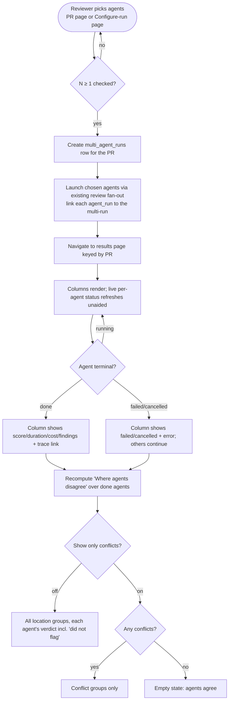

# Spec: Multi-Agent Review   |   Spec ID: SPEC-2026-07-21-multi-agent-review   |   Status: draft
Supersedes: none

## Problem & why

DevDigest can already run several review agents on one PR — `POST /pulls/:id/review` fans
out to every chosen agent in its own context, with per-agent failure isolation, and each run
streams live over SSE. But the product surfaces this as a fire-and-forget dropdown
("run all / run one") on the PR page and then scatters the results: each agent's review lands
as a separate row grouped only by the PR head SHA, with no side-by-side comparison, no notion
of "these two agents flagged the same spot", and no way to see cost or time before paying for
the fan-out.

A reviewer who wants a second (and third) opinion therefore cannot answer the two questions
that make multiple agents worth the money: **"do they agree?"** and **"was it worth the
spend?"**. Duplicate findings from different agents nag as if they were distinct problems;
genuine disagreements (one agent flags a line, another stays silent) are invisible; and there
is no pre-run estimate to decide whether running five agents is worth ~$0.20.

**Multi-Agent Review** turns the existing parallel-execution capability into a first-class
flow: pick agents (with a per-agent time/cost hint drawn from their own past runs), see a
summary estimate before running, watch the agents run as live parallel tracks, then compare
their findings side by side — including a "Where agents disagree" view that groups findings
landing on the **same line of the same file** and shows each agent's verdict, including "did
not flag". The grouping is a deterministic exact-key bucket (no extra model call, no
similarity threshold); the estimates are deterministic averages over past runs. Nothing about
the review engine itself changes — this feature is a grouping, estimation, and presentation
layer on top of machinery that already exists.

### Grounding — what already exists (reuse, do not rebuild)

- **Parallel execution is done.** `POST /pulls/:id/review` creates one `agent_runs` row per
  target up front, returns the run ids immediately, then runs the agents in the background with
  per-agent try/catch isolation (`server/src/modules/reviews/routes.ts:31-48`,
  `service.runReview` `service.ts:109-145`, `ReviewRunExecutor.executeRuns`/`runOneAgent`
  `run-executor.ts:60,160`, isolation at `129-156`). The multi-agent picker just supplies the
  chosen set.
- **Per-run cost/time/score are already persisted.** `agent_runs` carries `durationMs`,
  `costUsd`, `tokensIn/out`, `findingsCount`, `score`, `blockers`, `status`, `error`
  (`db/schema/runs.ts:8-38`), written by `completeAgentRun` (`repository/run.repo.ts:145`).
  These are the raw material for both the estimates and the column headers.
- **The multi-run table is an unreferenced stub.** `multi_agent_runs` exists with only
  `id, workspaceId, prId, ranAt` and **no** linkage from `agent_runs` to it
  (`db/schema/runs.ts:48-57`). Nobody reads or writes it. `agent_runs` today are grouped only
  by `headSha`.
- **The transport contracts are partly scaffolded.** `MultiAgentRun`, `AgentColumn`,
  `AgentColumnFinding`, `Conflict`, `ConflictTake` already exist as Zod schemas
  (`vendor/shared/contracts/observability.ts:22-86`) with zero producers/consumers. They are a
  starting point, not a finished contract — see *Contracts* for the gaps (no estimate fields;
  `Conflict` is file:line-only; column finding lacks `confidence`/`suggestion`).
- **Finding Accept/Dismiss is fully functional today.** `accepted_at`/`dismissed_at` columns
  (`db/schema/reviews.ts:44-45`), `setFindingAccepted`/`setFindingDismissed`, and
  `POST /findings/:id/(accept|dismiss)` (`reviews/routes.ts:188-194`, `findings.ts`) already
  persist a verdict. `FindingActionKind` also lists `learn`/`reply`, which the starter
  deliberately rejects (`findings.ts:31-33`) — that is exactly why Learn / Turn into eval case
  are inert placeholders here (decision 5).
- **There is NO reusable range-overlap primitive to lean on — and v1 does not need one.**
  Checked: `rangeIntersects` (`reviewer-core/src/grounding.ts:41`) takes a `Set<number>` of
  diff-hunk lines, not a range-vs-range test, and `rangesOverlap`
  (`server/src/modules/eval/scorer.ts:45`) is **not exported** — "reusing" it would mean pulling a
  private helper out of the unrelated `eval` module into `reviews` for three lines. More
  importantly, range-overlap is not an equivalence relation (10–15 overlaps 14–20 overlaps 19–25,
  but 10–15 and 19–25 do not), so grouping by overlap is a union-find / interval-sweep whose
  output depends on iteration order — it cannot satisfy the determinism AC-20 requires, and the
  `Conflict` contract is keyed by a single `line` and cannot express a range group anyway.
  **v1 grouping is therefore an exact `(file, start_line)` bucket** — a plain `Map` key,
  deterministic by construction, zero new matching logic and zero cross-module import
  (decision 1). Range-overlap and semantic/essence similarity are both explicitly out of scope.
- **Live status / trace are reused wholesale.** SSE `GET /runs/:id/events` (replay-first,
  `routes.ts:63-107`), the `RunBus` (`platform/sse.ts`), `RunEventKind` = info|tool|result|error
  (`contracts/trace.ts`), the client `useRunEvents` hook, `LiveLogStream`, `RunTraceDrawer`, and
  `GET /runs/:id/trace` all exist. This feature only surfaces live status in the column headers
  and links each column to its existing trace.
- **Left-nav is a static registry.** `NAV` in `client/src/vendor/ui/nav.ts` defines the sidebar
  groups; a `Multi-Agent Review` entry is added there (the sibling `Agent Performance` entry is
  another worktree's and is out of scope, though its nav slot may be reserved).

## Goals / Non-goals

- Goal: An agent picker on the PR page that replaces the existing `RunReviewDropdown` — per-agent
  checkboxes with a per-agent time hint, a Clear action, a Configure-agents link, and a primary
  "Run multi-agent review (N)" button that creates a multi-run for that PR with the chosen set and
  navigates to the results page.
- Goal: A **Multi-Agent Review → Configure run** page: step 1 pick a PR, step 2 checkbox-select
  agents (each showing a time+cost hint and a one-line description), a Select-all action, an empty
  state until a PR is chosen, and a "Run multi-agent review (N)" button with a summary pre-run
  estimate beside it.
- Goal: **Pre-run estimates** (a genuinely new mechanic): per-agent time+cost hints and a summary
  estimate, both computed deterministically from that agent's own completed successful past runs, scoped
  to the current repo.
- Goal: A **Multi-Agent Review results page**, keyed by PR, showing the latest multi-run in a
  **single Columns mode** — one live track per agent, with status, score, duration, cost, findings
  count, and a View-trace link. Clicking a finding in a column opens its detail (confidence,
  suggested fix, action buttons) by **reusing the existing `FindingCard`**, not a new detail view.
- Goal: A **"Where agents disagree"** block, shown below the columns: findings grouped by an exact
  `(file, start_line)` key, each group showing every completed agent's verdict including "did not
  flag", with a "Show only conflicts" toggle.
- Goal: A **real multi-run grouping**: persist a `multi_agent_runs` row and link each `agent_run`
  the multi-run launched to it, so the results page reads one coherent multi-run rather than
  re-deriving a set from `headSha`.
- Goal: Functional **Accept / Dismiss** on findings in the detail view (persist a per-finding
  verdict), reusing the existing finding-action path.
- Non-goal: Changing the review engine, the grounding gate, the injection guard, the run-executor,
  or the SSE/trace machinery — all reused unchanged.
- Non-goal: **Real git worktrees / the agent-runner.** Execution reuses the existing in-process
  run-executor; `ci/` and `agent-runner/` are out of scope entirely. The mockup's "fan-out via
  worktrees" copy is **not** carried over — the UI uses the scaffolded string naming the real
  mechanism instead (AC-14, decision 6 revised).
- Non-goal: **The Compose Review drawer** (curates findings before publishing) — a different
  feature, untouched.
- Non-goal: **Semantic / LLM-based clustering** for grouping (decision 1) — deferred; the grouping
  is a deterministic exact-key bucket with no model call.
- Non-goal: **The Agent Performance / Per-Agent Stats page** — another worktree owns it. This
  feature only *preserves* the per-finding→agent attribution as raw material for it; it builds no
  stats page and no `AgentStats` producer.
- Non-goal: **History of previous multi-runs** (decision 3) — the results page shows only the
  latest multi-run for a PR; browsing older ones is deferred.
- Non-goal: **A second "Tabs + detail" display mode and the Columns↔Tabs toggle** (v1
  simplification) — the mockup's tabbed variant is presentational over identical data and doubles
  the UI surface for no new information. v1 ships Columns only; the finding detail is the existing
  `FindingCard`, not a new component. Deferred, not cancelled.
- Non-goal: **Range-overlap or any threshold-based grouping** (v1 simplification) — grouping is the
  exact `(file, start_line)` key described above. Two agents flagging lines 41 and 42 of the same
  file land in *different* groups; that is the accepted cost of a provably deterministic v1.
- Non-goal: Making **Learn / Turn into eval case** do anything (decision 5) — rendered but inert
  placeholders, hooks for future homework.

## User stories

- US-1: As a reviewer on a PR, I want to quickly pick which agents to run and see how long each
  takes, so that I launch a multi-agent review without leaving the PR page. *(BUILD — picker)*
- US-2: As a reviewer, I want a dedicated configure page where I pick a PR, select agents with a
  time+cost hint and description each, and see a summary estimate before I run, so that I decide
  whether the fan-out is worth the spend. *(BUILD — configure page + estimates)*
- US-3: As a reviewer, I want to watch the selected agents run as live parallel columns with status
  and cost in each header, so that I follow progress and spot a failing agent immediately.
  *(BUILD results page + REUSE parallel execution, SSE)*
- US-4: As a reviewer, I want to open a finding from an agent's column and see its confidence and
  suggested fix, and to Accept or Dismiss it, so that I triage each agent's findings.
  *(REUSE `FindingCard` + REUSE finding actions)*
- US-5: As a reviewer, I want a "Where agents disagree" view that groups findings starting on the
  same line of the same file and shows each agent's verdict including "did not flag", with a
  conflicts-only toggle, so that duplicates stop nagging and real disagreements become visible.
  *(BUILD grouping)*
- US-6: As a reviewer returning to a PR, I want the results page to show the latest multi-run for
  that PR, and re-running to supersede it, so that the URL is stable and always current.
  *(BUILD multi-run grouping + keying)*
- US-7: As a maintainer, I want each multi-run to persist a real grouping that links its agent runs,
  and to preserve which agent produced each finding, so that later stats work has clean data.
  *(BUILD multi-run persistence + attribution preservation)*

## Assumptions

- Estimates are averaged over that agent's **successfully completed** (`status = done`) past
  `agent_runs`, scoped to the current repo — if false (e.g. failed runs with `durationMs = 0` / null
  `costUsd` are included): every hint is skewed toward zero and the summary estimate is meaningless.
- The chosen agents run through the **existing** `POST /pulls/:id/review` fan-out and executor
  unchanged, one review model call per agent per PR (single-pass default) — if false (the multi-run
  needs its own execution path): the per-agent isolation, SSE, trace, and cost-recording guarantees
  must be re-verified rather than inherited.
- Each `agent_run` a multi-run launches records which multi-run it belongs to via one new **nullable**
  `multi_agent_run_id` FK column on `agent_runs`, and the results read model is a plain join — if false:
  the results page cannot gather a multi-run's runs except by re-deriving from `headSha`, which cannot
  distinguish two multi-runs at the same head.
- The `MultiAgentRun`/`AgentColumn`/`Conflict` scaffold contracts are **reused** (dual-vendored server +
  client), the only additive fields being `cancelled` in `AgentColumn.status` and the detail view's reuse
  of the fuller `FindingRecord` (`confidence`/`suggestion`) — if false (a parallel net-new contract is
  added): the scaffold becomes dead code and the two shapes can drift.
- Per-agent `score` (0–100) and per-finding `confidence` (0–1) are the **existing** persisted values
  from the review run, not new computations — if false: the column score ring and the detail
  confidence would need a new source and re-costing.

## Acceptance criteria (EARS)

### Picker on the PR page (BUILD)

- AC-1: The PR page **shall** present an agent picker in place of the old run-review dropdown, listing
  every agent with a checkbox, a per-agent time hint, a Clear action, a Configure-agents link, and a
  primary button labelled "Run multi-agent review (N)" where N is the count of checked agents.
  The picker is a **trigger + panel**: the header shows a compact "Pick agents to run (N)" control and
  the list opens on click, so a workspace with many agents cannot swamp the PR header. The panel
  **shall not** close when a checkbox is ticked (which is why the shared `Dropdown` kit — it calls
  `onClose()` on every item click, `vendor/ui/kit/Dropdown.tsx:12-15` — is not reused), and **shall**
  close on Escape and on an outside click, preserving the selection.
  _(observable: the PR header renders a trigger, not the list; opening it reveals one checkbox per
  agent, a Configure-agents control, and a primary button whose label count equals the number of
  checked boxes; ticking two boxes leaves the panel open with count 2; Escape and an outside click
  close it and reopening shows the selection intact)_
- AC-2: WHILE no agent is checked, the system **shall** disable the "Run multi-agent review" button and
  show its count as 0.
  _(observable: with zero boxes checked the button is disabled and reads "(0)"; checking one enables it
  and reads "(1)")_
- AC-3: WHEN the user clicks "Run multi-agent review (N)" on the PR page with N ≥ 1 agents checked, the
  system **shall** create a multi-run for that PR with exactly the checked set and navigate to the
  Multi-Agent Review results page for that PR (it **shall not** execute inline on the PR page).
  _(observable: the click issues one create-multi-run request carrying the N checked agent ids and the
  browser lands on the results route for that PR showing N live columns)_

### Configure-run page (BUILD)

- AC-4: WHILE no PR has been picked on the Configure-run page, the system **shall** show an empty state
  reading "Pick a pull request first" and **shall not** render the agent list or an estimate.
  _(observable: before a PR is chosen the agent checkboxes and the summary estimate are absent and the
  empty-state text is shown)_
- AC-5: WHEN a PR is picked, the system **shall** render a checkbox per agent, each with a one-line
  description and a time+cost hint (e.g. "8.2s · $0.06"), plus a Select-all action and a "Run
  multi-agent review (N)" button with an adjacent summary estimate.
  _(observable: after picking a PR each agent row shows a description and a "Ns · $X" hint, a Select-all
  control is present, and a summary estimate string renders beside the run button)_
- AC-6: WHEN the user runs the review from the Configure-run page, the system **shall** create a
  multi-run for the picked PR with the checked set and navigate to that PR's results page, identically
  to the PR-page entry point (AC-3).
  _(observable: the configure-page run and the PR-page run reach the same results route and produce a
  multi-run with the same agent set)_

### Pre-run estimates (BUILD — new mechanic)

- AC-7: The per-agent time and cost hint **shall** be the mean `durationMs` and mean `costUsd` over that
  agent's completed successful (`done`) past runs scoped to the current repo (failed/cancelled runs, whose
  duration is 0 and cost null, are excluded); IF an agent has no such history, THEN its hint **shall** read
  "—" (no estimate).
  _(observable: an agent with prior done runs shows a numeric "Ns · $X" hint equal to the mean of those
  runs; an agent with no prior done run shows "—")_
- AC-8: The summary pre-run estimate **shall** compute time as the MAX of the selected agents' time hints
  (parallel fan-out) and cost as the SUM of the selected agents' cost hints; an agent with no history
  **shall** be excluded from the cost sum and the summary **shall** be marked approximate.
  _(observable: for a selection of agents with hints, the summary time equals the largest per-agent time
  and the summary cost equals the sum of the available per-agent costs; when any selected agent lacks
  history the summary carries an "approximate" marker)_
- AC-9: WHERE every selected agent lacks history, the system **shall** render the summary with no numeric
  time or cost (e.g. "parallel fan-out" only), never a fabricated or zero estimate.
  _(observable: selecting only history-less agents yields a summary with no "Ns"/"$X" numbers and no
  crash)_
- AC-10: IF the estimate data cannot be computed (query failure), THEN the picker and Configure-run page
  **shall** still allow selecting and running agents, rendering hints as "—" rather than blocking.
  _(observable: with the estimate source forced to fail, agents are still checkable and the run button
  still works; hints read "—")_

### Multi-run grouping & persistence (BUILD)

- AC-11: WHEN a multi-run is created, the system **shall** persist a `multi_agent_runs` record for the PR
  and link every `agent_run` it launches to that record, so the run set is retrievable as one multi-run.
  _(observable: after creation a multi_agent_runs row exists and every launched agent_run resolves back
  to it; the results read returns exactly those runs as its columns)_
- AC-12: The system **shall** preserve, for every finding, which agent (and which run) produced it; the
  multi-run grouping **shall** be a read-time overlay and **shall not** merge, reassign, or drop any
  agent's findings.
  _(observable: each finding still resolves to exactly one agent/run after grouping; the same finding
  count per agent is present before and after the disagreement view is computed)_
- AC-13: WHEN a new multi-run is created for a PR that already has one, the newer multi-run **shall**
  become the one the results page shows for that PR; the prior multi-run's rows **shall not** be deleted.
  _(observable: after a second run, the results page for the PR shows the second multi-run's columns; the
  first multi-run's agent_runs still exist in run history)_

### Results page — Columns mode (BUILD + REUSE)

- AC-14: The results page **shall** be keyed by PR and **shall** render the latest multi-run for that PR,
  with a header showing "N selected agents · parallel", the PR title, a summary of the form
  "N agents · <fan-out mechanism> · <total time> · <total cost>", and a Configure-run button. The
  mechanism wording **shall** be the already-scaffolded string (`client/messages/en/runs.json:120`,
  today "fan-out via p-queue"), which names the real in-process mechanism — **not** "via worktrees",
  which would advertise an isolation this feature does not implement. There is **no** display-mode
  toggle in v1 — Columns is the only mode.
  _(observable: the results route for a PR renders the header string with N, the mechanism label from
  the i18n layer, and the totals, plus a Configure-run control; no mode toggle is present, and the
  string "worktrees" appears nowhere on the page)_
- AC-15: The system **shall** render one column per agent whose header shows the agent's live status,
  score, duration, cost, and findings count, and a View-trace link.
  _(observable: each column header shows a status, a score value (or blank when unavailable), duration,
  cost, findings count, and a trace link that opens that run's existing trace)_
- AC-16: WHILE a selected agent's run is in progress, the system **shall** reflect its live status in its
  column header and **shall** update to the terminal status on completion **without a manual refresh**.
  The mechanism is deliberately left to the implementation: the repo's existing live-run-status precedent
  is a self-clearing poll (`usePrRuns`, `client/src/lib/hooks/reviews.ts:40-48`), and the reused SSE hook
  `useRunEvents` (`reviews.ts:168-215`) carries **only** `{events, running}` — no status, score, cost or
  terminal signal — so SSE alone cannot drive a column header and may only be overlaid as an activity
  line. Terminal status is DB state and **shall** be read as such.
  _(observable: a running agent's header shows a running state and transitions to done/failed on its own
  as the run finishes, with no user action; the assertion is on the transition, never on the transport)_
- AC-17: WHEN the user opens a finding in a column, the system **shall** show that finding's confidence,
  its suggested fix, and the action buttons by rendering the **existing** `FindingCard` component
  (`client/src/app/repos/[repoId]/pulls/[number]/_components/FindingCard/`), not a new detail view.
  _(observable: opening a finding shows a confidence value, the suggestion text (or an empty-suggestion
  state), and the finding's action buttons, rendered by the same component the PR page already uses)_
- AC-18: WHEN the user clicks Accept or Dismiss on a finding, the system **shall** persist that verdict for
  that specific finding via the existing finding-action path and reflect the new state in the UI; acting on
  one agent's finding **shall not** change any other agent's finding at the same location.
  _(observable: Accept marks that finding accepted and it renders as accepted; a co-located finding from a
  different agent is unchanged)_
- AC-19: `FindingCard` exposes **one** unified handler, `onAction?: (action: FindingCardAction, reply?)`
  (`FindingCard.tsx:37-60`), not a prop per button — and AC-18 requires accept/dismiss to be wired, so the
  page **must** pass it. The page's `onAction` **shall** therefore handle only `"accept"` and `"dismiss"`
  and return immediately for every other action, so Learn and Turn-into-eval-case perform no request and
  no state change (inert placeholder).
  _(observable: clicking Learn / Turn into eval case on this page issues no request and changes no finding
  state, while Accept/Dismiss on the same card do both; the PR page's own wiring of the same component is
  unaffected)_

### "Where agents disagree" grouping (BUILD)

- AC-20: The system **shall** group findings across agents by the **exact key `(file, start_line)`** — a
  plain map bucket — with no model call, no range/overlap logic, no threshold, and no title/kind matching.
  _(observable: two findings with the same `file` and the same `start_line` land in one group regardless of
  their titles, kinds, or end lines; a different file or a different `start_line` splits them — including
  adjacent lines such as 41 vs 42; group membership is byte-for-byte identical across repeated
  computations on the same findings, in any input order)_
- AC-21: Within a group, the system **shall** show, for every agent that completed (`done`) in the
  multi-run, that agent's verdict at the location — its finding's severity if it flagged, or "did not flag"
  otherwise; "did not flag" is exactly the set of completed agents in the multi-run minus the agents with a
  finding in that location bucket.
  _(observable: a group over three done agents where two flagged and one did not shows two severities and
  one "did not flag")_
- AC-22: WHEN "Show only conflicts" is enabled, the system **shall** show only location groups where the
  completed agents disagree — at least one flagged and at least one "did not flag", or the flagging agents
  assigned divergent severities — and hide unanimous groups.
  _(observable: toggling the control hides groups where every completed agent agrees and keeps groups with a
  "did not flag" or a severity split)_
- AC-23: IF no conflict groups exist WHILE "Show only conflicts" is enabled, THEN the system **shall** show
  an explicit empty state ("No disagreements — agents agree"), not a blank area.
  _(observable: with the toggle on and no conflicts, a labelled empty state renders)_
- AC-24: WHILE one or more selected agents have not yet reached a terminal status, the system **shall**
  compute the disagreement block only over agents already in `done` status and **shall not** report a still
  -running agent as "did not flag"; the block **shall** recompute as further agents complete.
  _(observable: mid-run, a still-running agent appears as pending/absent in groups, never as "did not flag";
  once it completes with no finding at a location it then shows "did not flag")_
- AC-24a: The `Conflict.line` a group is keyed and rendered by **shall** be the group's `start_line`, and
  `Conflict.title` **shall** be taken from one member finding by a deterministic rule (first by severity,
  then by finding id) — never model-composed and never order-dependent.
  _(observable: recomputing a group over the same findings in a shuffled order yields the identical
  `line` and `title`)_

### Security / cross-cutting

- AC-25: Every new multi-run create/read route **shall** resolve the caller's workspace via the auth
  context and scope its queries by `workspaceId`; a PR or multi-run outside the caller's workspace **shall**
  resolve as not-found.
  _(observable: requesting or creating a multi-run for another workspace's PR returns 404, never another
  workspace's data)_
- AC-26: The create-multi-run route **shall** carry a per-route rate limit at least as tight as the existing
  review trigger (max 10 per minute), being a fan-out to N cost-incurring model calls; the read route need
  not.
  _(observable: the create route defines a rate-limit override and exceeding it returns 429; the read route
  is unthrottled beyond the global default)_

## Edge cases

- No agents checked on either picker → run button disabled, count 0. → AC-2.
- Agent with no completed-run history → per-agent hint "—", excluded from summary cost, summary marked
  approximate. → AC-7, AC-8.
- Every selected agent history-less → summary shows no numeric estimate. → AC-9.
- Estimate query fails → picker still usable, hints "—". → AC-10.
- One agent fails mid-run while others continue (reused per-agent isolation) → its column shows failed
  with its error, other agents unaffected and still complete. → AC-16 (surfaces the failed status), AC-12
  (others unaffected). Also see *LLM usage*.
- An agent completes with zero findings → its column shows a findings count of 0 and an empty findings list,
  a valid result (not an error). → AC-15, AC-21 (it contributes "did not flag" everywhere).
- An agent completed but did not flag a grouped location → shows "did not flag" in that group. → AC-21.
- "Show only conflicts" with no conflicts → explicit empty state. → AC-23.
- Disagreement block while runs still stream → computed over done agents only; running agents never counted
  as "did not flag"; recomputes on completion. → AC-24.
- PR with no prior multi-run (first visit / only ever single-agent runs) → results page shows a
  first-run/empty state prompting to configure a run, not a 404. → **accepted: covered by AC-14** (latest
  multi-run is null → empty state; a dedicated criterion is unnecessary as it is the null case of AC-14).
- Re-running creates a newer multi-run superseding the displayed one → results page flips to the newer
  multi-run; prior rows retained. → AC-13.
- Accept/Dismiss on a finding that is one of several co-located across agents → applies per-finding only,
  preserving per-agent attribution. → AC-18, AC-12.
- Column status vocabulary includes `cancelled` (a run can be cancelled via the existing cancel path) →
  the column reflects a cancelled run as a terminal non-done status and excludes it from "did not flag".
  → **accepted: treated as a terminal non-`done` status** — like `failed`, a cancelled agent did not
  complete, so its silence is not a "did not flag" signal (AC-21/AC-24 scope to `done`).
- A finding's `suggestion` is null (optional field) → detail view shows an empty-suggestion state, not a
  blank crash. → AC-17.

## Non-functional

- Performance: reading a multi-run (columns + conflicts) issues **no** model call — it composes persisted
  `agent_runs`, reviews, and findings plus the deterministic grouping — and **shall** return within a p95 of
  500 ms for a multi-run of up to 8 agents. Estimates are deterministic aggregate reads over `agent_runs`,
  likewise sub-second.
- Cost: this feature adds **zero** new model calls of its own; the only model spend is the reused review
  runs (one call per agent per PR, single-pass default — see *LLM usage*). The create-multi-run route is
  rate-limited to ≤ 10/min (AC-26).
- Security: new routes are workspace-scoped with cross-workspace resources resolving as not-found (AC-25);
  the create route is rate-limited (AC-26). No new untrusted text reaches a prompt (see *Untrusted inputs*).
  No secret-shaped field is stored — `multi_agent_runs` and the run linkage hold only ids and timestamps.
  Finding titles (model-authored) are rendered as escaped text, never as HTML.
- a11y: the pickers, the column finding controls, action buttons, and "Show only conflicts" toggle **shall** meet WCAG
  2.1 AA — every control keyboard-operable and labelled; per-agent status and score conveyed by text, not
  color alone; the run button's disabled state announced. The score ring shows its numeric value as text.
- i18n: all new user-facing strings go through the client i18n layer with keys added to every locale (a
  missing key is a build-time error in this repo); the "did not flag", "approximate", empty-state, and
  status labels are i18n keys, never hard-coded literals.

## LLM usage & determinism

This feature reaches model calls **transitively** — it launches the existing review runs — and adds none
of its own.

- Inputs:
  - Per-agent time/cost hints and the summary estimate — [deterministic: mean over the agent's completed
    successful (`done`) `agent_runs` (`durationMs`, `costUsd`), scoped to the current repo; no model call].
  - Column headers (status, score, duration, cost, findings count) — [reused: persisted `agent_runs` /
    review data from the review runs; no new call].
  - The "Where agents disagree" grouping — [deterministic: an exact `(file, start_line)` map key; no
    range/overlap logic, no title/kind matching, no threshold, explicitly no LLM (decision 1)].
  - The review findings themselves — [reused: **1** structured review model call **per selected agent, per
    PR** via the existing single-pass executor; N selected agents ⇒ N calls, run in parallel with per-agent
    isolation. This feature does not change that count].
- On model failure: a single agent's failure is isolated by the reused executor — its column shows a
  `failed` status with the run's error text (never a blank), the other agents complete normally, and the
  multi-run itself still succeeds (AC-16, AC-12). No new bare-error surface is introduced; the deterministic
  columns/estimates/grouping never fail on a model error.
- Non-determinism: the review runs are model-authored, so an agent's findings, score, verdict, and summary
  **may vary** between runs on the same PR — tests **shall not** assert on exact finding text, exact score
  numbers, or exact cost. What **is** deterministic and safe to assert: the estimate aggregates for a fixed
  set of past runs (AC-7, AC-8), the group membership for a fixed set of findings (AC-20), the "did not
  flag"/conflict classification over a fixed set of completed agents (AC-21, AC-22), the per-finding verdict
  persistence (AC-18), and all call counts (N agents ⇒ N calls, grouping/estimates ⇒ 0 calls).

## Workflow



Branch traceability: N-check gate → AC-2; create + link → AC-11; navigate + header → AC-3/AC-6/AC-14;
live status → AC-16; terminal done/failed columns → AC-15/AC-16; per-agent isolation → AC-12; grouping over
done agents → AC-20/AC-21/AC-24; conflicts toggle + empty → AC-22/AC-23.

## Cross-module interactions

This feature spans **client** and **server**; **reviewer-core** is reused unchanged (the review engine, the
grounding gate, the `<untrusted>` mechanism). It is therefore a top-level `specs/` spec.

- **client** replaces the PR-page `RunReviewDropdown` with the agent picker; adds the Multi-Agent Review
  Configure-run page and results page (App Router: thin `page.tsx`, route-local `_components/<Name>/`, data
  via `lib/hooks/*` → `lib/api.ts`, no direct fetch in components); adds the "Where agents disagree" block;
  and adds the `Multi-Agent Review` left-nav entry. It reuses `useRunEvents`/`LiveLogStream` for live status
  and `RunTraceDrawer` for View-trace, and the existing `FindingCard` for finding detail (AC-17). New
  strings extend the client i18n layer. Both entry points (PR-page picker and Configure-run page) share
  **one** run mutation, **one** results page, and the same checkbox/estimate building blocks (decision 5).
  Note the two nav registries that do NOT auto-sync (`client/INSIGHTS.md:167`): a new page needs an entry
  in `vendor/ui/nav.ts` **and** a case in `components/app-shell/helpers.ts` `activeKeyFor`.
- **server** owns: a create-multi-run operation (persist a `multi_agent_runs` row, launch the chosen agents
  through the existing `POST /pulls/:id/review` fan-out and executor, and link each launched `agent_run` to
  the multi-run); a read model returning the latest multi-run for a PR as a `MultiAgentRun` (columns +
  conflicts); an estimate/aggregation read model over `agent_runs`; and reuse of the existing
  `POST /findings/:id/(accept|dismiss)` path for verdicts. All new routes follow the `getContext` +
  workspace-scoped-404 + rate-limit precedent (AC-25/AC-26). The scaffolded `multi_agent_runs` table needs a
  real write path **and** a new linkage from `agent_runs` (a nullable multi-run reference, or a join) —
  neither exists today.
- **reviewer-core**: no change required, and nothing is imported from it for the grouping. The exact
  `(file, start_line)` key needs no overlap primitive at all, so neither `rangeIntersects`
  (`reviewer-core/src/grounding.ts:41`, which takes a `Set<number>` of diff lines and is the wrong shape)
  nor the eval scorer's unexported `rangesOverlap` (`server/src/modules/eval/scorer.ts:45`) is touched —
  no cross-module import is created for three lines of arithmetic.

**Failure contract:** a single agent's model failure is isolated (its column shows `failed` + error, others
complete, the multi-run succeeds — AC-16/AC-12); an estimate-source failure degrades to "—" hints without
blocking a run (AC-10); a cross-workspace PR/multi-run resolves as 404 (AC-25).

**Dual-vendored contract note:** the `MultiAgentRun`/`AgentColumn`/`AgentColumnFinding`/`Conflict`/
`ConflictTake` schemas plus the new estimate shapes live in `@devdigest/shared`, which is vendored twice
(`server/src/vendor/shared` and `client/src/vendor/shared`). Any change to them is by construction a
server-AND-client two-file edit that must stay byte-for-byte identical — budget the fallout.

```mermaid
sequenceDiagram
    participant UI as client (picker / results page)
    participant SRV as server (multi-run capability)
    participant EXE as existing review fan-out + executor
    participant DB as agent_runs / multi_agent_runs / findings
    participant SSE as RunBus (reused SSE)

    UI->>SRV: create multi-run (PR, checked agent ids) [workspace-scoped, rate-limited]
    SRV->>DB: insert multi_agent_runs row
    SRV->>EXE: launch chosen agents (unchanged fan-out)
    EXE->>DB: one agent_run per agent, linked to the multi-run
    SRV-->>UI: multi-run id + run ids
    UI->>SSE: optionally subscribe per run for an activity line (reused)
    SSE-->>UI: run events per agent (no status/score/cost — see AC-16)
    UI->>SRV: read latest multi-run for PR (authoritative status, refreshed unaided)
    SRV->>DB: gather linked agent_runs + reviews + findings
    SRV->>SRV: build columns; compute deterministic conflict groups (done agents)
    SRV-->>UI: MultiAgentRun { columns, conflicts }
    UI->>SRV: accept/dismiss a finding (reused path)
    SRV->>DB: set accepted_at / dismissed_at for that finding
```

## Contracts

Shapes only — fields, direction, optionality, valid values, failure shape. The `observability.ts` scaffold
is the starting point; the gaps below are what the feature must fill (extended in place, dual-vendored).

- **Create multi-run** (client → server): PR-scoped request carrying the chosen agent id set
  (`{ agentIds: string[] }`, non-empty). Returns the created multi-run id and the launched run targets
  (`{ run_id, agent_id, agent_name }[]`, reusing the existing review-run target shape). A PR outside the
  caller's workspace returns a handled 404 (AC-25); an empty agent set is rejected (AC-2 is the client guard;
  the server also validates non-empty).
- **Multi-run read model** (server → client) — extends the scaffolded `MultiAgentRun`
  `{ id, pr_id, pr_number?, ran_at, agent_count, total_duration_ms, total_cost_usd, columns[], conflicts[] }`:
  - `total_duration_ms` is the wall-clock span of the parallel fan-out (≈ MAX of the columns), **not** the
    sum; `total_cost_usd` is the SUM across columns and is nullable when no cost was captured.
  - `AgentColumn` (scaffold) `{ run_id, agent_id, agent_name, provider, model, status, verdict, score,
    summary, duration_ms, cost_usd, findings[] }` — the `status` set **must** cover the live and terminal
    states the results page needs (`running`, `done`, `failed`, and `cancelled`; the scaffold currently lists
    only `running|done|failed` and needs `cancelled`). `score` and `cost_usd` are nullable (null on a
    non-`done` run).
  - `AgentColumnFinding` (scaffold) is a column-level subset `{ id, severity, category, title, file,
    start_line, kind? }` and **shall NOT be widened**. The reused `FindingCard` (AC-17) needs a full
    `FindingRecord` (`confidence`, `suggestion`, `accepted_at`, `dismissed_at`), which the results page
    gets by **joining on `id` against the already-available `GET /pulls/:id/reviews` payload** — the same
    client-side-join-over-contract-edit call already made for Smart Diff (`INSIGHTS.md:122`). This keeps
    the dual-vendored contract edit down to the single `cancelled` status literal.
- **Conflict group** (server → client) — the scaffolded `Conflict` `{ file, line, title, takes[] }` is
  **reused as-is**: `line` is the group's `start_line` and is exactly the grouping key, so no new field is
  needed (AC-20, AC-24a).
  `ConflictTake` `{ agent_id, persona, verdict, note }` where `verdict` is a `Severity` or the literal
  `ignored` ("did not flag"). Takes are computed **only over `done` agents** (AC-24), so a group carries no
  take for a still-running/failed/cancelled agent, and "did not flag" is the completed-agent set minus the
  agents with a finding in that bucket (AC-21).
- **Estimate read model** (server → client, **net-new**): per agent, the mean time and cost over its
  completed successful (`done`) runs scoped to the current repo — `{ agent_id, avg_duration_ms: number |
  null, avg_cost_usd: number | null, sample_size: integer }`, where nulls mean "no history" (rendered "—",
  AC-7). The summary (MAX time / SUM cost, approximate flag) may be derived client-side from these per-agent
  values or returned alongside; either satisfies AC-8 as long as the MAX/SUM/approximate rules hold.
- **Finding verdict** (client → server): **reused unchanged** — `POST /findings/:id/(accept|dismiss)` sets
  `accepted_at`/`dismissed_at` and returns the updated finding. Per-finding, never per-group (AC-18).
- **Persisted multi-run + linkage** (server-internal): one `multi_agent_runs` row (PR-scoped) plus one new
  **nullable** `multi_agent_run_id` FK column on `agent_runs`; the read model is a plain join, no extra
  tables. Holds only ids and timestamps — no secret-shaped field.

## Untrusted inputs

**No new untrusted text reaches a model prompt.** The only model calls are the reused review runs, whose
untrusted inputs (the diff, PR title/description, repo map, callers, specs, intent) are already fenced by the
existing `<untrusted>` / `INJECTION_GUARD` mechanism in reviewer-core — unchanged here. This feature's own
new data flows are numeric aggregates (estimates), persisted finding rows, and ids/timestamps; none is fed
back into a prompt.

The one place PR/model-derived text is *rendered* is the results UI (finding titles, summaries, rationales,
suggestions — all model-authored, and file paths — repo-derived). These are displayed as escaped text via
React's default JSX escaping; none is passed to `dangerouslySetInnerHTML`, and any `file:line` link built
from a repo path uses the existing safe blob-URL helpers (http/https only). No keyword/regex injection filter
is added — that would violate the repo's single-guard rule.

## Rollout / migration

- **New stored shape (the single additive change):** one nullable `multi_agent_run_id` FK column on
  `agent_runs`, plus writing rows into the existing `multi_agent_runs` table. It is **additive and
  nullable** — every existing `agent_run` predates the column and simply has no multi-run, so it is never
  shown on the Multi-Agent Review page and continues to appear in the PR's existing run history exactly as
  today. No extra tables, no heuristic storage. Nothing is backfilled; there is no legacy multi-run to
  migrate (`multi_agent_runs` starts empty).
- **The results page shows the latest multi-run**, so a PR with only pre-feature single-agent runs shows the
  first-run/empty state (AC-14 null case) until a multi-run is created — no error, no broken link.
- **PR-page behavior changes:** the picker replaces the old `RunReviewDropdown`. The inline "run all / run
  one" affordance is gone; the same underlying execution now runs through the multi-run create path and is
  viewed on the new page. This is a UI replacement, not a data migration — existing reviews and runs are
  untouched and remain readable on their current surfaces.
- **Contracts** are the reused scaffold (dual-vendored) with exactly ONE additive change — the `cancelled`
  literal in `AgentColumn.status`; the detail view's `confidence`/`suggestion` come from a client-side join
  against `GET /pulls/:id/reviews`, not a contract widening. Safe to ship. The feature
  is safe to ship dark behind the new nav entry — it does nothing until a user creates a multi-run.

## Traceability

| Source | Covered by |
|--------|------------|
| US-1: PR-page picker with time hints, run button | AC-1, AC-2, AC-3, AC-7 |
| US-2: Configure page, estimates, summary before run | AC-4, AC-5, AC-6, AC-7, AC-8, AC-9 |
| US-3: live parallel tracks with status + cost | AC-14, AC-15, AC-16 |
| US-4: finding detail via reused `FindingCard`, Accept/Dismiss | AC-17, AC-18, AC-19 |
| US-5: "Where agents disagree" + conflicts toggle | AC-20, AC-21, AC-22, AC-23, AC-24, AC-24a |
| US-6: results keyed by PR, latest multi-run, supersede | AC-13, AC-14 |
| US-7: real multi-run grouping + attribution preserved | AC-11, AC-12 |
| Edge: no agents checked | AC-2 |
| Edge: agent with no history / all history-less | AC-7, AC-8, AC-9 |
| Edge: estimate query fails | AC-10 |
| Edge: one agent fails mid-run | AC-16, AC-12 |
| Edge: agent with zero findings | AC-15, AC-21 |
| Edge: "did not flag" location | AC-21 |
| Edge: conflicts toggle, no conflicts | AC-23 |
| Edge: disagreement block while streaming | AC-24 |
| Edge: no prior multi-run for a PR | accepted: AC-14 null case |
| Edge: re-run supersedes | AC-13 |
| Edge: Accept/Dismiss on co-located finding | AC-18, AC-12 |
| Edge: cancelled run status | accepted: terminal non-`done`, excluded from "did not flag" |
| Edge: null suggestion | AC-17 |
| Workspace scoping / rate limit | AC-25, AC-26 |

## Design gaps & UX notes flagged during analysis

These are resolved into the criteria above; recorded here so the planner sees the reasoning.

- **"score" and "confidence" are existing values, not new computations.** The column score ring is the
  review run's persisted `score` (0–100, null on non-`done` runs); the detail confidence is the finding's
  `confidence` (0–1). Neither triggers a new call. A failed agent has a null score → the ring renders blank,
  not zero.
- **The disagreement block during streaming is the subtlest corner.** "Did not flag" is only meaningful for
  an agent that *completed* — a still-running agent has simply not answered yet, and a failed/cancelled agent
  never finished. The block therefore scopes to `done` agents and recomputes as agents finish (AC-24). This
  is a deliberate decision, not an oversight.
- **Accept/Dismiss is per-finding, never per-group.** Each agent's finding is a distinct row with its own
  id; the disagreement view is a read overlay. Acting on one co-located finding must not touch another's —
  this is what keeps per-agent→finding attribution clean for the future stats page (AC-18, AC-12).
- **Estimates are one simple aggregate.** Mean over that agent's completed successful (`done`) runs scoped
  to the current repo, excluding failed/cancelled runs (their `durationMs` is 0 and `costUsd` null). No
  last-N window, no percentile, no config — summary time is MAX across selected agents, summary cost is SUM
  (decision 2, AC-7/AC-8).
- **Grouping is an exact `(file, start_line)` key in v1 — deliberately NOT range overlap.** Overlap is not
  transitive (10–15 ~ 14–20 ~ 19–25, but 10–15 ≁ 19–25), so grouping by it is a union-find whose output
  depends on input order; that directly contradicts the determinism AC-20 demands, and the `Conflict`
  contract's single `line` field cannot express a range group regardless. There is also no primitive to
  reuse — `rangeIntersects` is `Set<number>`-shaped and `rangesOverlap` is unexported (see *Grounding*).
  The accepted cost: two agents flagging lines 41 and 42 of one file land in different groups. No
  title-token overlap, no kind-agreement, no threshold (decision 1). "Did not flag" = completed agents in
  the multi-run minus the agents with a finding in that bucket (AC-20/AC-21). Range-based and
  semantic/essence similarity are both explicitly deferred.
- **One display mode in v1 (Columns), and the finding detail is the existing `FindingCard`.** The mockup's
  Tabs+detail mode is presentational over identical data — it doubles the UI surface and re-implements a
  detail view (`confidence`, `suggestion`, action buttons) that `FindingCard.tsx` already renders, including
  a working "Turn into eval case" control (`FindingCard.tsx:35`). Cutting it removes roughly one implementer
  task. Deferred, not cancelled (AC-14, AC-17).
- **The `AgentColumn.status` scaffold lacks `cancelled`.** Runs are cancellable via the existing path, so the
  column status vocabulary needs `cancelled` added, treated as terminal non-`done`.
- **"Fan-out via worktrees" copy was dropped** (revised 2026-07-21). The mockup's wording advertises an
  isolation this feature does not implement, and the already-scaffolded string
  (`client/messages/en/runs.json:120`) honestly names the real in-process mechanism. AC-14 now mandates the
  scaffolded wording, which also means zero i18n edits for that line. Execution remains the existing
  in-process fan-out — `agent-runner`/`ci/` stay out of scope either way (decision 6).
- **AC-16 does not mandate SSE, and AC-19 cannot forbid passing a handler.** Both were written against an
  assumed API that the code does not have: `useRunEvents` carries no status/score/cost/terminal signal, and
  `FindingCard` has a single unified `onAction`. Both ACs were rewritten to assert the *observable*
  (the header transitions unaided; the extra buttons do nothing) rather than a mechanism the codebase
  cannot supply — see the Revision log.

## Open questions

None — the prior clarifications are resolved by the v1 simplification decisions: estimates are the simple
`done`-run mean scoped to the repo (decision 2), grouping is an exact `(file, start_line)` key with no
threshold and no overlap logic (decision 1), and the results page ships a single Columns mode reusing
`FindingCard` for detail (decision 5).

## Revision log

- **2026-07-21, v1 simplification pass** (applied before implementation planning, on the two findings from a
  code-grounded simplicity review): (1) grouping changed from *line-range overlap reusing an existing
  primitive* to an **exact `(file, start_line)` key** — the claimed primitive does not exist in a reusable
  shape and overlap-grouping is order-dependent, so the original AC-20 was not implementable as written;
  (2) the results page dropped from **two display modes to one** (Columns), with the finding detail reusing
  the existing `FindingCard` instead of a new Tabs+detail view. Affected: Problem statement, Grounding,
  Goals/Non-goals, US-3/US-4/US-5, AC-14/15/16/17/19/20, new AC-24a, Edge cases, Non-functional (a11y),
  LLM usage, Workflow, Cross-module, Contracts, Rollout, Traceability, Design gaps.
- **2026-07-21, post-planning correction pass** — three ACs asserted mechanisms the codebase does not have,
  found by the implementation planner reading the spec against the code and fixed before any implementer
  ran. **AC-14**: the mockup's "fan-out via worktrees" copy is replaced by the already-scaffolded string
  naming the real in-process mechanism (`client/messages/en/runs.json:120`) — the spec's own Design-gaps
  section already called the worktrees wording misleading, and this removes an i18n edit as a bonus.
  **AC-16**: no longer mandates SSE as the transport — `useRunEvents` (`client/src/lib/hooks/reviews.ts:168-215`)
  carries only `{events, running}` and cannot drive a column header; the AC now asserts the unaided
  transition and leaves the mechanism open (the repo's own precedent is a self-clearing poll).
  **AC-19**: no longer requires "passes no handler" — `FindingCard` has a single unified `onAction` and
  AC-18 forces it to be passed, so the AC now requires that handler to no-op for everything except
  accept/dismiss. In all three the *observable* is unchanged; only the mechanism claim was wrong.
- **2026-07-21, AC-1 picker shape** — the first implementation rendered the agent list **inline** in the
  PR header, which AC-1's original observable ("the PR page renders one checkbox per agent") literally
  permitted. With 6 agents in a real workspace it consumed the entire header, so AC-1 now specifies a
  **trigger + panel** and pins the two behaviours that make it usable: the panel stays open while boxes
  are ticked, and closes on Escape / outside click with the selection preserved. This restores the
  original design intent (a "Pick agents to run" dropdown) that the AC had failed to encode.
